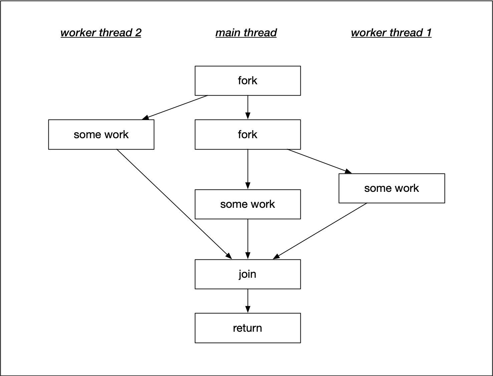
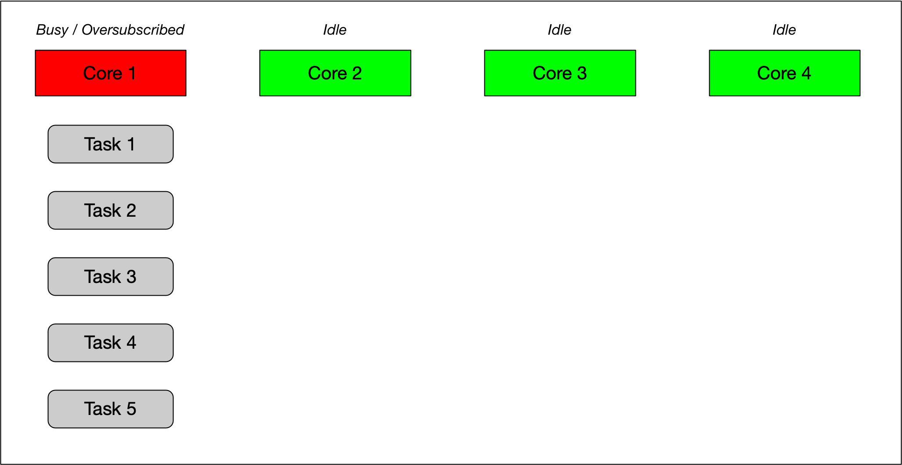
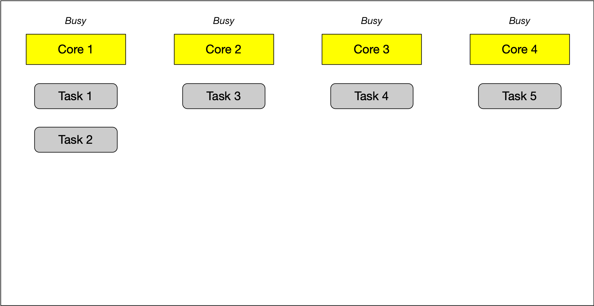

# 1. Introduction and Running Threads

## Introduction

---

### **并发编程的背景与重要性**
- **传统编程的顺序执行**：
  - 传统编程中，程序的执行是线性的，即一个步骤接着另一个步骤，执行顺序是确定的。
  - 这种方式适用于单核处理器，但随着硬件的发展，这种方式无法充分利用现代多核处理器的性能。

- **并发（Concurrency）**：
  - 并发是指一个系统同时执行多个独立任务的能力。
  - 并发的目的是提高程序的效率和性能，特别是在现代多核硬件架构上。

- **并发与并行（Concurrency vs Parallelism）**：
  - **并发**：任务之间可能是交替执行的，通过快速切换任务给人一种“同时进行”的错觉。
  - **并行**：任务在同一时间点真正同时运行，需要多核或多处理器支持。
  - **硬件并发（Hardware Concurrency）**：指硬件实际能够同时运行的任务数量，通常由系统的核心数或硬件线程数决定。

- **多核处理器的兴起**：
  - 过去，硬件性能提升主要依赖于提高处理器的时钟频率（Clock Rate）。
  - 近年来，芯片制造商转向多核设计（如2核、4核、16核等），程序员需要通过并发编程来利用这些多核架构的潜力。

---

### **并发编程的基本概念**
- **线程（Thread）**：
  - 一个线程是程序中可独立执行的路径。
  - 使用多个线程的程序称为多线程程序（Multithreading）。

- **任务切换（Task Switching）**：
  - 在单核系统中，操作系统通过快速切换任务（Task Switching）来模拟并发。
  - 这种切换速度非常快，用户感知不到任务是交替执行的。

- **数据竞争（Data Race）**：
  - 当多个线程同时访问共享数据，并且至少有一个线程尝试修改数据时，会发生数据竞争。
  - 数据竞争是并发编程中一个常见且严重的问题，需要通过同步机制来避免。

- **同步机制（Synchronization Mechanism）**：
  - 用于保证线程之间的数据访问是安全的。
  - 关键技术包括互斥锁（Mutex）、锁（Lock）和条件变量（Condition Variable）。

---

### **C++并发编程的支持**
- **C++11标准的引入**：
  - C++11 标准为语言增加了对并发编程的原生支持，包括线程、锁、条件变量等。
  - 这些工具使得编写并发程序更加简单和高效。

- **硬件线程数（Hardware Threads）**：
  - 硬件线程数表示系统可以真正并行运行的任务数。
  - 当任务数量超过硬件线程数时，系统会通过任务切换来处理额外的任务。

---

### **课程内容概览**
- **第一课：线程与进程**：
  - 介绍线程和进程的区别。
  - 学习如何启动线程并编写第一个多线程程序。
  - 引入课程项目：并发交通模拟器。

- **第二课：线程间数据共享**：
  - 学习如何在线程之间共享数据。
  - 介绍C++中的`promise`和`future`，用于线程间的数据传递。
  - 讨论如何避免数据竞争。

- **第三课：数据安全共享**：
  - 学习互斥锁（Mutex）和锁（Lock）的概念，保护共享数据免受数据竞争的影响。

- **第四课：条件变量与消息队列**：
  - 进一步学习条件变量（Condition Variable）的使用。
  - 设计消息队列（Message Queue）以实现线程间的安全数据交换。

- **课程项目**：
  - 利用所学知识扩展交通模拟器，添加交通信号灯功能。
  - 每辆车运行在自己的线程中，模拟真实的并发场景。

---

### **总结**
这门课程的目标是帮助学习者掌握C++中的并发编程技术，以便充分利用现代多核处理器的性能。通过学习线程、数据共享、互斥锁、条件变量等技术，学习者将能够编写安全、高效的并发程序，并应用到实际项目中，如并发交通模拟器。


## Threads and Processes

---

### **并发的第一种方式：多进程**
- **定义**：
  - 并发的第一种方式是将程序分成多个独立的单线程进程（Processes），这些进程可以同时运行。

- **进程间通信（Inter-Process Communication, IPC）**：
  - **定义**：独立的进程通过某些通信机制来交换数据。
  - **常见的通信机制**：
    - **信号（Signals）**：用于通知进程发生了某个特定事件。
    - **套接字（Sockets）**：通过网络或本地通信交换数据。
    - **文件（Files）**：通过共享文件进行数据交换。
    - **其他机制**：如共享内存、管道（Pipes）等。

- **多进程的优缺点**：
  - **优点**：
    1. **高安全性**：操作系统提供了进程间的隔离，避免一个进程意外修改另一个进程的数据。
    2. **高级通信机制**：操作系统提供了易于使用的通信工具。
    3. **分布式架构支持**：多个进程可以分布在不同的计算机上（如通过网络运行）。
  - **缺点**：
    1. **通信速度慢**：进程间通信需要通过操作系统管理，效率较低。
    2. **管理复杂**：需要处理进程的启动、销毁以及通信。
    3. **资源消耗大**：启动一个新进程需要耗费较多时间和系统资源。

---

### **并发的第二种方式：多线程**
- **定义**：
  - 并发的第二种方式是运行多个线程（Threads），它们在一个单独的进程中运行。
  - 线程被称为“轻量级进程”（Lightweight Processes），因为它们独立运行并有自己的指令集，但共享进程的资源。

- **线程的特性**：
  - **共享地址空间**：线程在同一进程内运行，共享同一个地址空间。这意味着：
    - 线程之间可以直接访问共享数据。
    - 减少了进程间通信的开销。

- **多线程的优缺点**：
  - **优点**：
    1. **低开销**：线程共享进程资源，启动和切换的开销比进程小得多。
    2. **高效的数据共享**：线程可以直接访问共享数据，而不需要通过复杂的通信机制。
  - **缺点**：
    1. **数据一致性问题**：由于线程共享数据，可能会导致**数据竞争（Data Race）**或**不一致性**。
    2. **复杂的同步管理**：程序员需要确保数据在多个线程间的一致性，这需要使用同步机制（如互斥锁、条件变量等）。

---

### **多进程与多线程的比较**
| **特性**     | **多进程**                                             | **多线程**                                           |
| ------------ | ------------------------------------------------------ | ---------------------------------------------------- |
| **隔离性**   | 进程之间相互隔离，不共享地址空间，安全性高。           | 线程共享地址空间，容易出现数据竞争问题。             |
| **启动开销** | 启动新进程需要较多时间和资源。                         | 启动新线程开销较小，速度更快。                       |
| **通信机制** | 需要通过IPC（如信号、套接字）进行通信，效率较低。      | 线程可以直接访问共享数据，通信效率高。               |
| **适用场景** | 适用于需要高隔离性或分布式架构的情况（如分布式系统）。 | 适用于需要高效率和频繁数据交互的情况（如实时系统）。 |
| **复杂性**   | 通信机制复杂，管理进程的生命周期需要更多代码。         | 数据共享容易，但需要同步机制来管理数据一致性。       |


### Detailed Explanation

#### Synchronous & Asynchronous

In this lesson, you will learn how to start and manage your first parallel path of execution, which runs concurrently with the main program and is thus asynchronous. In contrast to synchronous programs, the main program can continue with its line of execution without the need to wait for the parallel task to complete. The following figure illustrates this difference.


Before we start writing a first asynchronous program in C++, let us take a look at the differences between two important concepts : **processes and threads**.

#### Processes

A ***process*** (also called a task) is a computer program at runtime. It is **comprised of** the **runtime environment** provided by the operating system (OS), as well as of the **embedded binary code** of the program during execution. **A process is controlled by the OS** through certain actions with which it sets the process into one of several carefully defined **states**:


- **Ready** : After its creation, a process enters the ready state and is loaded into main memory. The process now is ready to run and is waiting for CPU time to be executed. Processes that are ready for execution by the CPU are stored in a queue managed by the OS.
- **Running** : The operating system has selected the process for execution and the instructions within the process are executed on one or more of the available CPU cores.
- **Blocked** : A process that is blocked is one that is waiting for an event (such as a system resource becoming available) or the completion of an I/O operation.
- **Terminated** : When a process completes its execution or when it is being explicitly killed, it changes to the "terminated" state. The underlying program is no longer executing, but the process remains in the process table as a "zombie process". When it is finally removed from the process table, its lifetime ends.
- **Ready suspended** : A process that was initially in ready state but has been swapped out of main memory and placed onto external storage is said to be in suspend ready state. The process will transition back to ready state whenever it is moved to main memory again.
- **Blocked suspended** : A process that is blocked may also be swapped out of main memory. It may be swapped back in again under the same conditions as a "ready suspended" process. In such a case, the process will move to the blocked state, and may still be waiting for a resource to become available.

Processes are **managed by the *scheduler*** of the OS. The scheduler can either let a process **run until it ends or blocks** (**non-interrupting scheduler**), or it can ensure that the currently running process is interrupted after a short period of time. The scheduler can **switch** back and forth between **different active processes** (**interrupting scheduler**), alternately assigning them CPU time. The latter is the typical scheduling strategy of any modern operating system.

Since the administration of processes is computationally taxing, operating systems support a more resource-friendly way of realizing concurrent operations: the threads.

#### Threads

A ***thread*** represents **a concurrent execution unit within a process**. In contrast to full-blown processes as described above, threads are characterized as light-weight processes (LWP). These are significantly easier to create and destroy: In many systems the creation of a thread is up to 100 times faster than the creation of a process. This is especially advantageous in situations, when the need for concurrent operations changes dynamically.


Threads exist within processes and share their resources. As illustrated by the figure above, a process can contain several threads or - **if no parallel processing is provided for in the program flow - only a single thread**.

**A major difference between a process and a thread** is that **each process has its own address space**, while **a thread does not require a new address space to be created**. All the **threads in a process can access its shared memory**. **Threads also share other OS dependent resources** such as processors, files, and network connections. As a result, the **management overhead for threads is typically less than for processes**. Threads, **however**, are not protected against each other and **must carefully synchronize when accessing the shared process resources to avoid conflicts.**

Similar to processes, **threads exist in different states**, which are illustrated in the figure below:


- **New** : A thread is in this state once it has been created. Until it is actually running, it will not take any CPU resources.

- **Runnable** : In this state, a thread might actually be running or it might be ready to run at any instant of time. It is the responsibility of the thread scheduler to assign CPU time to the thread.

- **Blocked** : A thread might be in this state, when it is waiting for I/O operations to complete. When blocked, a thread cannot continue its execution any further until it is moved to the runnable state again. It will not consume any CPU time in this state. The thread scheduler is responsible for reactivating the thread.

    

#### Summary

This section discusses the key differences between threads and processes, highlighting that **threads are the preferred concurrency tool in most major languages like C++ due to their low overhead and ease of use**. **However, challenges such as accessing shared memory are noted**. The next section will cover how to start a thread and perform parallel tasks alongside the main thread.


## Running a Single Thread

In this section, you will write your **first multi-threaded program using C++11 concurrency support** and determine the number of hardware threads available on your system. You are encouraged to run the code on your native hardware and compare results across different devices. For example, a MacBook Pro may support 4 threads, while an iMac Pro supports 20. You will **use the `std::thread` function to execute tasks in parallel** with the main thread and learn to **use the `join` command to ensure the worker thread completes its task before the program terminates**. Go ahead and start experimenting with concurrent programming!


### Concurrency Support in C++11

The concurrency support in C++ makes it possible for a program to execute multiple threads in parallel. Concurrency was first introduced into the standard with C++11. Since then, new concurrency features have been added with each new standard update, such as in C++14 and C++17. Before C++11, concurrent behavior had to be implemented using native concurrency support from the OS, using POSIX Threads, or third-party libraries such as BOOST. The standardization of concurrency in C++ now makes it possible to develop cross-platform concurrent programs, which is as significant improvement that saves time and reduces error proneness. Concurrency in C++ is provided by the thread support library, which can be accessed by including the header.

A running program consists of at least one thread. When the main function is executed, we refer to it as the "main thread". Threads are uniquely identified by their thread ID, which can be particularly useful for debugging a program. The code on the right prints the thread identifier of the main thread and outputs it to the console:

```cpp
#include <iostream>
#include <thread>

int main()
{
    std::cout << "Hello concurrent world from main! Thread id = " << std::this_thread::get_id() << std::endl;

    return 0;
}
```

These are the results when run:

```bash
Hello concurrent world from main! Thread id = 0x1f15c4240
```

You can compile this code from the terminal in the lower right using `g++` as follows:

```
g++ example_1.cpp
```

and run it with

```
./a.out
```

Note: The actual thread id and process exit message will vary from machine to machine.


Also, it is possible to retrieve the number of concurrent threads supported. The example on the right prints the number of concurrent threads supported to the console.

```cpp
#include <iostream>
#include <thread>

int main()
{
    unsigned int nThreads = std::thread::hardware_concurrency();
    std::cout << "This machine supports concurrency with " << nThreads << " concurrent threads available" << std::endl;

    return 0;
}
```

These are the results from a local machine at the time of writing:

```bash
This machine supports concurrency with 14 concurrent threads available
```

Try running this code to see what results you get!

### Starting a second thread

In this section, we will start a second thread in addition to the main thread of our program. To do this, we need to construct a thread object and pass it the function we want to be executed by the thread. Once the thread enters the runnable state, the execution of the associated thread function may start at any point in time.

```cpp
    // create thread
    std::thread t(threadFunction)
```

After the thread object has been constructed, the main thread will continue and execute the remaining instructions until it reaches the end and returns. It is possible that by this point in time, the thread will also have finished. But if this is not the case, the main program will terminate and the resources of the associated process will be freed by the OS. As the thread exists within the process, it can no longer access those resources and thus not finish its execution as intended.

To prevent this from happening and have the main program wait for the thread to finish the execution of the thread function, we need to call `join()` on the thread object. This call will only return when the thread reaches the end of the thread function and block the main thread until then.

The code on the right shows how to use `join()` to ensure that `main()` waits for the thread `t` to finish its operations before returning. It uses the function `sleep_for()`, which pauses the execution of the respective threads for a specified amount of time. The idea is to simulate some work to be done in the respective threads of execution.

```cpp
#include <iostream>
#include <thread>

void threadFunction()
{
    std::this_thread::sleep_for(std::chrono::milliseconds(100)); // simulate work
    std::cout << "Finished work in thread\n"; 
}

int main()
{
    // create thread
    std::thread t(threadFunction);

    // do something in main()
    std::this_thread::sleep_for(std::chrono::milliseconds(50)); // simulate work
    std::cout << "Finished work in main\n";

    // wait for thread to finish
    t.join();

    return 0;
}
```

To compile this code with `g++`, you will need to use the `-pthread` flag. `pthread` adds support for multithreading with the pthreads library, and the option sets flags for both the preprocessor and linker:

```
g++ example_3.cpp -pthread
```

**Note:** If you compile without the `-pthread` flag, you will see an error of the form: `undefined reference to pthread_create`. You will need to use the `-pthread` flag for all other multithreaded examples in this course going forward.

The code produces the following output:

```bash
Finished work in main
Finished work in thread
```

Not surprisingly, the **main function finishes before** the thread **because the delay inserted into the thread function is much larger than in the main** path of execution. The call to `join()` at the end of the main function ensures that it will not prematurely return. As an experiment, comment out `t.join()` and execute the program. What do you expect will happen? yes we will get main program will terminate and thread will be stoped.

```bash
Finished work in main
libc++abi: terminating
[1]    67828 abort      ./example
```

### Randomness of events

One very important trait of concurrent programs is their **non-deterministic behavior**. It **can not be predicted which thread the scheduler will execute** at which point in time. In the code on the below, the amount of work to be performed both in the thread function and in main has been split into two separate jobs.

```cpp
#include <iostream>
#include <thread>

void threadFunction()
{
    std::this_thread::sleep_for(std::chrono::milliseconds(50)); // simulate work
    std::cout << "Finished work 1 in thread\n"; 

    std::this_thread::sleep_for(std::chrono::milliseconds(50)); 
    std::cout << "Finished work 2 in thread\n"; 
}

int main()
{
    // create thread
    std::thread t(threadFunction);

    // do something in main()
    std::this_thread::sleep_for(std::chrono::milliseconds(50)); // simulate work
    std::cout << "Finished work 1 in main\n";

    std::this_thread::sleep_for(std::chrono::milliseconds(50)); 
    std::cout << "Finished work 2 in main\n";
    
    // wait for thread to finish
    t.join();

    return 0;
}
```


The console output shows that the work packages in both threads have been interleaved with the first package being performed before the second package.

```bash
Finish work 1 in thread
Finish work 1 in main
Finish work 2 in thread
Finish work 2 in main
```

Interestingly, when executed on my local machine, the order of execution has changed. Now, instead of finishing the second work package in the thread first, main gets there first.

```cpp
Finish work 1 in thread
Finish work 1 in main
Finish work 2 in main
Finish work 2 in thread
```

Executing the code several times more shows that the two versions of program output interchange in a seemingly random manner. This element of **randomness is an important characteristic of concurrent programs** and we have to take measures to deal with it in a controlled way that prevent unwanted behavior or even program crashes.

**Reminder:** You will need to use the `-pthread` flag when compiling this code, just as you did with the previous example. This flag will be needed for all future multithreaded programs in this course as well.

### Using join() as a barrier

In the previous example, the order of execution is determined by the scheduler. If we wanted to ensure that the thread function completed its work before the main function started its own work (because it might be waiting for a result to be available), we could achieve this by repositioning the call to join.

In the file on the below, the `.join()` has been moved to before the work in `main()`. The order of execution now always looks like the following:

```cpp
#include <iostream>
#include <thread>

void threadFunction()
{
    std::this_thread::sleep_for(std::chrono::milliseconds(50)); // simulate work
    std::cout << "Finished work 1 in thread\n"; 

    std::this_thread::sleep_for(std::chrono::milliseconds(50)); 
    std::cout << "Finished work 2 in thread\n"; 
}

int main()
{
    // create thread
    std::thread t(threadFunction);
    
    // wait for thread to finish
    t.join();

    // do something in main()
    std::this_thread::sleep_for(std::chrono::milliseconds(50)); // simulate work
    std::cout << "Finished work 1 in main\n";

    std::this_thread::sleep_for(std::chrono::milliseconds(50)); 
    std::cout << "Finished work 2 in main\n";

    return 0;
}
```

```bash
Finished work 1 in thread
Finished work 2 in thread
Finished work 1 in main
Finished work 2 in main
```

In later sections of this course, we will make extended use of the join() function to carefully control the flow of execution in our programs and to ensure that results of thread functions are available and complete where we need them to be.

### Detach

Let us now take a look at what happens if we don’t join a thread before its destructor is called. When we comment out join in the example above and then run the program again, it aborts with an error. The reason why this is done is that the designers of the C++ standard wanted to make debugging a multi-threaded program easier: Having the program crash forces the programer to remember joining the threads that are created in a proper way. Such a hard error is usually much easier to detect than soft errors that do not show themselves so obviously.

**There are some situations however, where it might make sense to not wait for a thread to finish its work.** This can be achieved by "detaching" the thread, by which the internal state variable "joinable" is set to "false". This works by calling the `detach()` method on the thread. The destructor of a detached thread does nothing: It neither blocks nor does it terminate the thread. In the following example, detach is called on the thread object, which causes the main thread to immediately continue until it reaches the end of the program code and returns. Note that a detached thread can not be joined ever again.

```cpp
#include <iostream>
#include <thread>

void threadFunction()
{
    std::this_thread::sleep_for(std::chrono::milliseconds(50)); // simulate work
    std::cout << "Finished work in thread\n"; 
}

int main()
{
    // create thread
    std::thread t(threadFunction);

    // detach thread and continue with main
    t.detach();

    // do something in main()
    std::this_thread::sleep_for(std::chrono::milliseconds(50)); // simulate work
    std::cout << "Finished work in main\n";

    return 0;
}
```


You can run the code above using `example_6.cpp` over on the right side of the screen.

**Programmers should be very careful though when using the `detach()`-method**. You have to make sure that the thread does not access any data that might get out of scope or be deleted. Also, we do not want our program to terminate with threads still running. Should this happen, such threads will be terminated very harshly without giving them the chance to properly clean up their resources - what would usually happen in the destructor. So a well-designed program usually has a well-designed mechanism for joining all threads before exiting.

### Summary

This section introduced the basics of writing a concurrent program in C++11, **highlighting how easy it is to create threads**, put them to sleep, and **synchronize them using `join`**. While concurrency may seem straightforward initially, it also introduces the **randomness** of events, a **major source of errors in concurrent programming**. The next section will delve deeper into starting threads using function objects.


## Starting a Thread with Function Objects

### Functions and Callable Objects

In the previous section, we have created our first thread by passing it a function to execute. We did not discuss this concept in depth at the time, but in this section we will focus on the details of passing functions to other functions, which is one form of a ***callable object***.

In C++, callable objects are object that can appear as the left-hand operand of the call operator. These can be pointers to functions, objects of a class that defines an overloaded function call operator and *lambdas* (an anonymous inline function), with which function objects can be created in a very simple way. In the context of concurrency, we can use callable objects to attach a function to a thread.

**In the last section, we constructed a thread object by passing a function to it without any arguments**. If we were limited to this approach, t**he only way to make data available from within the thread function would be to use global variables - which is definitely not recommendable and also incredibly messy.**

In this section, we will therefore look at several ways of **passing data to a thread function**.

### Starting Threads with Function Objects

The `std::thread` constructor can also be called with instances of classes that implement the function-call operator. In the following, we will thus define a class that has an overloaded `()`-operator. In preparation for the final project of this course, which will be a traffic simulation with vehicles moving through intersections in a street grid, we will define a (very) early version of the Vehicle class in this example:

```cpp
#include <iostream>
#include <thread>

class Vehicle
{
public:
    void operator()()
    {
        std::cout << "Vehicle object has been created \n" << std::endl;
    }
};


int main()
{
    // create thread 
    std::thread t(Vehicle()); // C++'s most vexing parse

    // do something in main()
    std::cout << "Finished work in main \n";

    // wait for thread to finish
    t.join();

    return 0;
}
```

When executing this code, the g++ compiler generates a warning, which is followed by an error:

```bash
error: request for member ‘join’ in ‘t’, which is of non-class type ‘std::thread(Vehicle (*)())’
     t.join();
```

So you will see an error when you compile `example_1.cpp`!

The **extra parentheses** suggested by the compiler avoid what is known as C++'s "most vexing parse", which is a specific form of syntactic **ambiguity resolution** in the C++ programming language.

The expression was coined by Scott Meyers in 2001, who talks about it in details in his book "Effective STL". The "most vexing parse" comes from a rule in C++ that says that anything that could be considered as a function declaration, the compiler should parse it as a function declaration - even if it could be interpreted as something else.

In the previous code example, the line

```cpp
std::thread t1( Vehicle() ); 
```

is seemingly **ambiguous**, since it could be interpreted either as

1. a **variable definition** for variable `t` of class `std::thread`, initialized with an **anonymous instance** of class Vehicle or
2. a **function declaration** for a function `t` that returns an object of type `std::thread` and has a single (unnamed) **parameter** that is a **pointer to function** returning an object of type `Vehicle`

Most programmers would presumable expect the first case to be true, but the **C++ standard requires it to be interpreted as the second** - **hence the compiler warning**.

There are **three ways of forcing the compiler to consider the line as the first case**, which would create the thread object we want:

- Add an extra pair of parentheses
- Use copy initialization
- Use uniform initialization with braces

The following code shows all three variants:

```cpp
#include <iostream>
#include <thread>

class Vehicle
{
public:
    void operator()()
    {
        std::cout << "Vehicle object has been created \n" << std::endl;
    }
};


int main()
{
    // create thread 
    //std::thread t0(Vehicle()); // C++'s most vexing parse
    
    std::thread t1( (Vehicle()) ); // Add an extra pair of parantheses
    
    std::thread t2 = std::thread( Vehicle() ); // Use copy initialization
    
    std::thread t3{ Vehicle() };// Use uniform initialization with braces

    // do something in main()
    std::cout << "Finished work in main \n";

    // wait for thread to finish
    t1.join();
    t2.join();
    t3.join();

    return 0;
}
```

The output of this code sample shows that all three threads are executed and the Vehicle object is properly initialized:

```bash
Vehicle object has been created 

Vehicle object has been created 

Vehicle object has been created 

Finished work in main 
```

**Whichever option we use, the idea is the same**: the **function object is copied into internal storage accessible to the new thread**, and the new thread invokes the operator `()`. The `Vehicle` class can of course have data members and other member functions too, and **this is one way of passing data to the thread function: pass it in as a constructor argument and store it as a data member**:

```cpp
#include <iostream>
#include <thread>

class Vehicle
{
public:
    Vehicle(int id) : _id(id) {}
    void operator()()
    {
        std::cout << "Vehicle #" << _id << " has been created" << std::endl;
    }

private:
    int _id;
};

int main()
{
    // create thread
    std::thread t = std::thread(Vehicle(1)); // Use copy initialization

    // do something in main()
    std::cout << "Finished work in main \n";

    // wait for thread to finish
    t.join();

    return 0;
}
```

In the above code example, the class `Vehicle` has a constructor that takes an integer and it will store it internally in a variable `_id`. In the overloaded function call operator, the vehicle id is printed to the console. In `main()`, we are creating the `Vehicle` object using copy initialization. The output of the program is given below:

```bash
Finished work in main 
Vehicle #1 has been created
```

As can easily be seen, the integer ID has been successfully passed into the thread function.

### Lambdas

**Another very useful way of starting a thread** and **passing information to it** is by using a **lambda expression** ("Lambda" for short). With a Lambda you can easily create simple function objects.

The name "Lambda" comes from Lambda Calculus , a mathematical formalism invented by Alonzo Church in the 1930s to investigate questions of logic and computability. Lambda calculus formed the basis of LISP, a functional programming language. Compared to Lambda Calculus and LISP, **C ++ - Lambdas** have the **properties** of being **unnamed** and **capturing variables** from the surrounding context, but **lack the ability to execute and return functions**.

A Lambda is **often used as an argument for functions** that can take a callable object. This can be easier than creating a named function that is used only when passed as an argument. In such cases, Lambdas are generally preferred **because they allow the function objects to be defined inline**. If Lambdas were not available, we would have to define an extra function somewhere else in our source file - which would work but at the expense of the clarity of the source code.

**A Lambda is a function object** (a "functor"), so **it has a type and can be stored and passed around**. Its result object is called a "closure", which can be called using the operator `()` as we will see shortly.

A lambda formally **consists of three parts**: a capture list `[]` , a parameter list `()` and a main part `{}`, which contains the code to be executed when the Lambda is called. Note that in principal all parts could be empty.

***The capture list** `[]`*: By default, variables outside of the enclosing {} around the main part of the Lambda can not be accessed. **By adding a variable to the capture list** however, it **becomes available within the Lambda either as a copy or as a reference**. The **captured variables become a part of the Lambda**.

By default, **variables in the capture block can not be modified** within the Lambda. **Using the keyword "mutable" allows to modify the parameters captured by copy**, and to call their non-const member functions within the body of the Lambda. The following code examples show several ways of making the external variable "id" accessible within a Lambda.

```cpp
#include <iostream>

int main()
{
    // create lambdas
    int id = 0; // Define an integer variable

    //auto f0 = []() { std::cout << "ID = " << id << std::endl; }; // Error: 'id' cannot be accessed

    id++;
    auto f1 = [id]() { std::cout << "ID = " << id << std::endl; }; // OK, 'id' is captured by value

    id++;
    auto f2 = [&id]() { std::cout << "ID = " << id << std::endl; }; // OK, 'id' is captured by reference

    //auto f3 = [id]() { std::cout << "ID = " << ++id << std::endl; }; // Error, 'id' may not be modified

    auto f4 = [id]() mutable { std::cout << "ID = " << ++id << std::endl; }; // OK, 'id' may be modified

    // execute lambdas
    f1();
    f2();
    f4();

    return 0;
}
```

Even though we have been using Lambdas in the above example in various ways, **it is important to note that a Lambda does not exist at runtime.** The runtime effect of a Lambda is the generation of an object, which is known as *closure*. The difference between a **Lambda** and the **corresponding closure** is **similar to** the distinction between a **class** and an **instance of the class**. A class exists only in the source code while the objects created from it exist **at runtime**.

We can use **(a copy of) the closure (i.e. f0, f1, …)** to execute the code within the Lambda at a position in our program **different to the line where the function object was created.**

*The parameter list `()`* : The way **parameters are passed to a Lambda** is basically **identical to calling a regular function**. If the Lambda takes no arguments, these parentheses can be omitted (except when "mutable" is used).

The following example illustrates how the function object is first created and then used to pass the parameter id later in the code.

### **Quiz**

The code below shows how to capture variables by value and by reference, how to pass variables to a Lambda using the parameter list and how to use the closure to execute the Lambda.

```cpp
#include <iostream>

int main()
{
    int id = 0; // Define an integer variable

    // capture by reference (immutable)
    auto f0 = [&id]() { std::cout << "a) ID in Lambda = " << id << std::endl; };

    // capture by value (mutable)
    auto f1 = [id]() mutable { std::cout << "b) ID in Lambda = " << ++id << std::endl; };
    f1(); // call the closure and execute the code witin the Lambda
    std::cout << "c) ID in Main = " << id << std::endl;

    // capture by reference (mutable)
    auto f2 = [&id]() mutable { std::cout << "d) ID in Lambda = " << ++id << std::endl; };
    f2(); 
    std::cout << "e) ID in Main = " << id << std::endl; 

    // pass parameter 
    auto f3 = [](const int id) { std::cout << "f) ID in Lambda = " << id << std::endl; };   
    f3(++id);

    // observe the effect of capturing by reference at an earlier point in time
    f0(); 

    return 0;
}
```

Please think about the resulting output for a while. What would you say is the order in which the various strings are printed to the console? Also, what will be the value for ID for each output?

```bash
b) ID in Lambda = 1
c) ID in Main = 0
d) ID in Lambda = 1
e) ID in Main = 1
f) ID in Lambda = 2
a) ID in Lambda = 2

```

### Starting Threads with Lambdas

A **Lambda** is, as we’ve seen, **just an object** and, like other objects it may be **copied, passed as a parameter, stored in a container,** etc. The **Lambda object has its own scope and lifetime** which may, in some circumstances, be different to those objects it has ‘captured’. Programers need to **take special care when capturing local objects by reference** because **a Lambda’s lifetime may exceed the lifetime of its capture list:** It must be **ensured that the object to which the reference points is still in scope when the Lambda is called**. This is especially **important in multi-threading programs.**

So let us start a thread and pass it a Lambda object to execute:

```cpp
#include <iostream>
#include <thread>

int main()
{
    int id = 0; // Define an integer variable

    // starting a first thread (by reference)
    auto f0 = [&id]() {
        std::this_thread::sleep_for(std::chrono::milliseconds(100));
        std::cout << "a) ID in Thread (call-by-reference) = " << id << std::endl;
    };
    std::thread t1(f0);

    // starting a second thread (by value)
    std::thread t2([id]() mutable {
        std::this_thread::sleep_for(std::chrono::milliseconds(50));
        std::cout << "b) ID in Thread (call-by-value) = " << id << std::endl;
    });

    // increment and print id in main
    ++id;
    std::cout << "c) ID in Main (call-by-value) = " << id << std::endl;

    // wait for threads before returning
    t1.join();
    t2.join();

    return 0;
}
```

The output of the program looks like this

```
c) ID in Main (call-by-value) = 1
b) ID in Thread (call-by-value) = 0
a) ID in Thread (call-by-reference) = 1
```

As you can see, the output in the main thread is generated first, at which point the variable ID has taken the value 1. Then, the call-by-value thread is executed with ID at a value of 0. Then, the call-by-reference thread is executed with ID at a value of 1. This illustrates the effect of passing a value by reference : **when the data to which the reference refers changes before the thread is executed, those changes will be visible to the thread**. We will see other examples of such behavior later in the course, as this is a primary source of concurrency bugs.

- 多线程程序的执行顺序通常是非确定性的，具体取决于操作系统的线程调度。
- 但在这段代码中，由于两个线程分别休眠了 **100 毫秒** 和 **50 毫秒**，可以确定以下几点：
  1. 第二个线程（`t2`）会比第一个线程（`t1`）更早完成。
  2. 主线程的输出会先于两个子线程的输出。

1. **主线程输出 `id`**：
   ```cpp
   c) ID in Main (call-by-value) = 1
   ```
   - 主线程将 `id` 自增为 `1` 并输出。
   - 这是第一个输出，因为主线程的操作不受线程休眠的影响。

2. **第二个线程（`t2`）输出 `id`**：
   ```cpp
   b) ID in Thread (call-by-value) = 0
   ```
   - 第二个线程捕获的是 `id` 的副本，值为线程启动时的 `0`。
   - 由于线程休眠了 50 毫秒，因此这是第二个输出。

3. **第一个线程（`t1`）输出 `id`**：
   ```cpp
   a) ID in Thread (call-by-reference) = 1
   ```
   - 第一个线程捕获的是 `id` 的引用，因此它输出的是主线程中 `id` 的最新值（即自增后的 `1`）。
   - 由于线程休眠了 100 毫秒，因此这是最后一个输出。


## Starting a Thread with Variadic Templates & Member Functions

### Passing Arguments using a Variadic Template

In the previous section, we have seen that one way to pass arguments in to the thread function is to package them in a class using the function call operator. Even though this worked well, it would be very cumbersome to write a special class every time we need to pass data to a thread. We can also use a Lambda that captures the arguments and then calls the function. But there is a simpler way: The thread constructor may be called with a function and all its arguments. That is possible because the **thread constructor is a *variadic template* that takes multiple arguments.**

Before C++11, classes and functions could only accept a fixed number of arguments, which had to be specified during the first declaration. **With variadic templates it is possible to include any number of arguments of any type.**

```cpp
#include <iostream>
#include <thread>
#include <string>

void printID(int id)
{
    std::this_thread::sleep_for(std::chrono::milliseconds(50));
    std::cout << "ID = " << id << std::endl;
    
}

void printIDAndName(int id, std::string name)
{
    std::this_thread::sleep_for(std::chrono::milliseconds(100));
    std::cout << "ID = " << id << ", name = " << name << std::endl;
}

int main()
{
    int id = 0; // Define an integer variable

    // starting threads using variadic templates
    std::thread t1(printID, id);
    std::thread t2(printIDAndName, ++id, "MyString");
    std::thread t3(printIDAndName, ++id); // this procudes a compiler error

    // wait for threads before returning
    t1.join();
    t2.join();
    //t3.join();


    return 0;
}
```

As seen in the code example above, a first thread object is constructed by passing it the function `printID` and an integer argument. Then, a second thread object is constructed with a function `printIDAndName`, which requires an integer and a string parameter. If only a single argument was provided to the thread when calling `printIDAndName`, a compiler error would occur (see `std::thread t3` in the example) - which is the same type checking we would get when calling the function directly.

There is **one more difference** between **calling a function directly** and **passing it to a thread**: With the former, arguments may be passed by value, by reference or by using move semantics - depending on the signature of the function. **When calling a function using a variadic template, the arguments are by default either moved or copied - depending on wether they are rvalues or lvalues.** There are ways however which allow us to overwrite this behavior. If you want to move an lvalue for example, we can call `std::move`. In the following example, two threads are started, each with a different string as a parameter. **With `t1`, the string name1 is copied by value,** which **allows us to print name1 even after `join`** has been called. The second string `name2` is passed to the thread function using **move semantics**, which means that it is not available any more after `join` has been called on `t2`.

```cpp
#include <iostream>
#include <thread>
#include <string>

void printName(std::string name, int waitTime)
{
    std::this_thread::sleep_for(std::chrono::milliseconds(waitTime));
    std::cout << "Name (from Thread) = " << name << std::endl;
}

int main()
{
    std::string name1 = "MyThread1";
    std::string name2 = "MyThread2";

    // starting threads using value-copy and move semantics 
    std::thread t1(printName, name1, 50);
    std::thread t2(printName, std::move(name2), 100);

    // wait for threads before returning
    t1.join();
    t2.join();

    // print name from main
    std::cout << "Name (from Main) = " << name1 << std::endl;
    std::cout << "Name (from Main) = " << name2 << std::endl;

    return 0;
}
```

The console output shows how using copy-by-value and `std::move` affect the string parameters:

```
Name (from Thread) = MyThread1
Name (from Thread) = MyThread2
Name (from Main) = MyThread1
Name (from Main) = 
```

In the following example, the signature of the thread function is modified to take a non-const reference to the string instead.

```cpp
#include <iostream>
#include <thread>
#include <string>

void printName(std::string &name, int waitTime)
{
    std::this_thread::sleep_for(std::chrono::milliseconds(waitTime));
    name += " (from Thread)";
    std::cout << name << std::endl;
}

int main()
{
    std::string name("MyThread");

    // starting thread
    std::thread t(printName, std::ref(name), 50);

    // wait for thread before returning
    t.join();

    // print name from main
    name += " (from Main)";
    std::cout << name << std::endl;

    return 0;
}
```

When passing the string variable name to the thread function, we need to **explicitly mark it as a reference**, so the compiler will treat it as such. This can be done by using the **`std::ref`** function. In the console output it becomes clear that the string has been successfully modified within the thread function before being passed to `main`.

```
MyThread (from Thread)
MyThread (from Thread) (from Main)
```

**Even though the code works, we are now sharing mutable data between threads - which will be something we discuss in later sections of this course as a primary source for concurrency bugs.**


### Starting Threads with Member Functions

In the previous sections, you have seen how to start threads with functions and function objects, with and without additional arguments. Also, you now know how to pass arguments to a thread function by reference. **But what if we wish to run a member function other than the function call operator**, **such as a member function of an existing object**? Luckily, the C++ library can handle this use-case: For calling member functions, the `std::thread` function requires an additional argument for the object on which to invoke the member function.

```cpp
#include <iostream>
#include <thread>

class Vehicle
{
public:
    Vehicle() : _id(0) {}
    void addID(int id) { _id = id; }
    void printID()
    {
        std::cout << "Vehicle ID=" << _id << std::endl;
    }

private:
    int _id;
};

int main()
{
    // create thread
    Vehicle v1, v2;
    std::thread t1 = std::thread(&Vehicle::addID, v1, 1); // call member function on object v
    std::thread t2 = std::thread(&Vehicle::addID, &v2, 2); // call member function on object v

    // wait for thread to finish
    t1.join();
    t2.join();

    // print Vehicle id
    v1.printID();
    v2.printID();

    return 0;
}
```

In the example above, the Vehicle object v1 is passed to the thread function by value, thus a copy is made which does not affect the "original" living in the main thread. Changes to its member variable `_id` will thus not show when printing calling `printID()` later in main. The second `Vehicle` object `v2` is instead passed by reference. Therefore, changes to its `_id` variable will also be visible in the `main` thread - hence the following console output:

```cpp
Vehicle ID=0
Vehicle ID=2
```

In the previous example, we **have to ensure that the existence of `v2` outlives the completion of the thread `t2` - otherwise there will be an attempt to access an invalidated memory address**. An **alternative** is to use a **heap-allocated object** and **a reference-counted pointer such as `std::shared_ptr<Vehicle>`** to **ensure that the object lives as long as it takes the thread to finish its work**. The following example shows how this can be implemented:

```cpp
int main()
{
    // create thread
    std::shared_ptr<Vehicle> v(new Vehicle);
    std::thread t = std::thread(&Vehicle::addID, v, 1); // call member function on object v
    
    // wait for thread to finish
    t.join();
    
    // print Vehicle id
    v->printID();
    
    return 0;
}
```


### Adding a Member Function

Change the code from the previous example in a way that a new member variable `_name` of type `std::string` is added to the `Vehicle` class. Then, define a function `setName` which takes a string as an argument and assigns this to `_name`. The function `setName` needs to be started as a thread from `main`. Also, add a function `printName` to the `Vehicle` class which is used at the end of `main` to print the name to the console.

```cpp
#include <iostream>
#include <thread>

class Vehicle
{
public:
    Vehicle() : _id(0) {}
    void addID(int id) { _id = id; }
    void setName(std::string name) { _name = name; }
    void printID()
    {
        std::cout << "Vehicle ID=" << _id << std::endl;
    }
    void printName()
    {
        std::cout << "Vehicle name=" << _name << std::endl;
    }

private:
    int _id;
    std::string _name;
};

int main()
{
    // create thread 1
    std::shared_ptr<Vehicle> v(new Vehicle);
    std::thread t1 = std::thread(&Vehicle::addID, v, 1); 

    // create thread 2
    std::thread t2 = std::thread(&Vehicle::setName, v, "MyVehicle"); 

    // wait for thread to finish
    t1.join();
    t2.join();

    // print Vehicle id
    v->printID();
    v->printName();

    return 0;
}
```


## Running Multiple Threads

### Introduction

#### 1. 分叉-合并并行（Fork-Join Parallelism）
- **概念**：这是一种基本的并行编程模式
- **工作方式**：
  - **分叉（Fork）**：主线程创建（分叉）多个子线程执行任务
  - **合并（Join）**：等待所有子线程完成后，再继续执行主线程
- **特点**：
  - 结构清晰
  - 易于理解和实现
  - 适合处理可以并行的独立任务

#### 2. 线程屏障（Thread Barriers）
- **作用**：同步多个线程的执行点
- **工作原理**：
  - 设置一个同步点（屏障点）
  - 当线程达到屏障点时会等待
  - 直到所有线程都到达屏障点才继续执行
- **应用场景**：
  - 需要等待所有并行任务完成后才能继续的情况
  - 多个线程需要同步进行的场合

#### 3. 线程句柄管理（Thread Handles in Vector）
- **目的**：更好地管理多个线程
- **优势**：
  - 可以批量管理线程
  - 便于进行循环操作
  - 更容易实现动态线程数量的调整
- **实现方式**：
  ```cpp
  std::vector<std::thread> threads;
  // 添加线程
  threads.push_back(std::thread(...));
  ```

#### 4. 并发限制（Concurrency Ban）
- **含义**：在并发编程中的各种限制和约束
- **类型**：
  - 正式限制：语言规范或标准库强制的限制
  - 非正式限制：最佳实践或性能考虑导致的限制
- **目的**：
  - 避免数据竞争
  - 确保线程安全
  - 提高程序可靠性

#### 总结
这个章节主要介绍：
1. 如何同时管理和运行多个线程
2. 基本的并行编程模式
3. 线程同步机制
4. 线程管理的实用技巧
5. 并发编程中需要注意的限制和约束


### Fork-Join Parallelism

Using threads follows a basic concept called "fork-join-parallelism". The basic mechanism of this concept follows a simple **three-step pattern**:

1. **Split** the flow of execution into a parallel thread ("fork")
2. **Perform** some work in both the main thread and the parallel thread
3. **Wait** for the parallel thread to finish and unite the split flow of execution again ("join")

The following diagram illustrates the basic idea of forking:



In the main thread, the program flow is forked into three parallel branches. In both worker branches, some work is performed - which is why threads are often referred to as "worker threads". Once the work is completed, the flow of execution is united again in the main function using the `join()` command. In this example, **join acts as a barrier where all threads are united**. The execution of main is in fact halted, until both worker threads have successfully completed their respective work.

```cpp
#include <iostream>
#include <thread>
#include <vector>

void printHello()
{
    // perform work
    std::cout << "Hello from Worker thread #" << std::this_thread::get_id() << std::endl;
}

int main()
{
    // create threads
    std::vector<std::thread> threads;
    for (size_t i = 0; i < 5; ++i)
    {
        // copying thread objects causes a compile error
        /*
        std::thread t(printHello);
        threads.push_back(t); 
        */

        // moving thread objects will work
        threads.emplace_back(std::thread(printHello));
    }

    // do something in main()
    std::cout << "Hello from Main thread #" << std::this_thread::get_id() << std::endl;

    // call join on all thread objects using a range-based loop
    for (auto &t : threads)
        t.join();

    return 0;
}

```

In the following example, a number of threads is created and added to a vector. **The basic idea is to loop over the vector at the end of the main function and call join on all the thread objects inside the vector**.

When we try to compile the program using the **`push_back()`** function (which is the usual way in most cases), we get a **compiler error**. The problem with our code is that by pushing the thread object into the vector, we **attempt to make a copy of it**. However, **thread objects do not have a copy constructor and thus can not be duplicated**. **If this were possible, we would create yet another branch** in the flow of execution - **which is not what we want**. The solution to this problem is to use move semantics, which provide a convenient way for the contents of objects to be 'moved' between objects, rather than copied. It might be a good idea at this point to refresh your knowledge on move semantics, on rvalues and lvalues as well as on rvalue references, as we will make use of these concepts throughout the course.

**To solve our problem, we can use the function `emplace_back()` instead of `push_back()`**, which **internally uses move semantics** to move our thread object into the vector without making a copy. When executing the code, we get the following output:

```
Hello from Worker thread #Hello from Worker thread #140370329347840140370337740544
Hello from Worker thread #140370320955136
Hello from Worker thread #140370346133248

Hello from Main thread #140370363660096
Hello from Worker thread #140370312562432
```

This is surely not how we intended the console output to look like. When we take a close look at the call to `std::cout` in the thread function, we can see that it actually consists of three parts: the string "Hello from worker…", the respective thread id and finally the line break at the end. In the output, **all three components are completely intermingled**. Also, when the program is run several times, the output will look different with each execution. **This shows us two important properties of concurrent programs:**

1. **The order in which threads are executed is non-deterministic**. Every time a program is executed, there is a chance for a completely different order of execution.
2. **Threads may get preempted in the middle of execution** and another thread may be selected to run.

These **two properties pose a major problem with concurrent applications**: A program may run correctly for thousands of times and suddenly, due to a particular interleaving of threads, there might be a problem. From a debugging perspective, **such errors are very hard to detect as they can not be reproduced easily.**


### A First Concurrency Bug

Let us adjust the program code from the previous example and use a Lambda instead of the function `printHello()`. Also, we will pass the loop counter i into the Lambda to enforce an individual wait time for each thread. The idea is to prevent the interleaving of text on the command line which we saw in the previous example.

```cpp
#include <iostream>
#include <thread>
#include <chrono>
#include <random>
#include <vector>

int main()
{
    // create threads
    std::vector<std::thread> threads;
    for (size_t i = 0; i < 10; ++i)
    {
        // create new thread from a Lambda
        threads.emplace_back([&i]() {

            // wait for certain amount of time
            std::this_thread::sleep_for(std::chrono::milliseconds(10 * i));

            // perform work
            std::cout << "Hello from Worker thread #" << i << std::endl;
        });
    }

    // do something in main()
    std::cout << "Hello from Main thread" << std::endl;

    // call join on all thread objects using a range-based loop
    for (auto &t : threads)
        t.join();

    return 0;
}

```

When executing the code however, the following output is generated on the console:


Clearly this is not what we expected. Can you find the bug and fix the code so that each thread gets the corresponding integer ranging from 0 to 9?

```cpp
// change below 
[&i]() {

            // wait for certain amount of time
            std::this_thread::sleep_for(std::chrono::milliseconds(10 * i));

            // perform work
            std::cout << "Hello from Worker thread #" << i << std::endl;
        }
// to this
[i]() {

            // wait for certain amount of time
            std::this_thread::sleep_for(std::chrono::milliseconds(10 * i));

            // perform work
            std::cout << "Hello from Worker thread #" << i << std::endl;
        }
```


## Exercise: Traffic Simulation

### Overview

The purpose of the program is to **simulate traffic in a city grid** consisting of **vehicles**, **streets**, and **intersections**. Vehicles will move randomly across the grid and change direction whenever they reach an intersection. Each object in the simulation (vehicles, streets, intersections) will operate independently in its own thread, making this a **concurrent simulation**.

The goal is to carefully manage threads and synchronize them to avoid crashes, undefined behavior, and concurrency errors.

---

### **Class Structure**

The simulation consists of the following main components:


- **`TrafficObject`**: A base class encapsulating default behavior shared by all traffic-related objects. It is abstract and will not have direct instances.
- **`Intersection`**, **`Vehicle`**, and **`Street`**: Derived classes inheriting from `TrafficObject`.
- **`Graphics`**: Handles visualization by rendering all `TrafficObject` instances on a top-view map of a city (e.g., New York, Paris).

---

### **Program Workflow**

The program has two primary flows of execution:

1. **Main Function Workflow**: Responsible for initializing the simulation.
2. **Vehicle Execution Workflow**: Manages the behavior of each vehicle in its thread.


#### **Main Function Workflow**
1. **Create and Connect Intersections and Streets**: Establish relationships between intersections and streets.
2. **Assign Street and Target Intersection to Vehicles**: Each vehicle is assigned a street and a destination intersection.
3. **Simulate Vehicles**: Start a thread for each vehicle, running its `drive()` function.
4. **Visualize TrafficObjects**: Continuously update and render the positions of all objects.

#### **Vehicle Execution Workflow**
1. **Initialize Stopwatch**: Used to track elapsed time.
2. **Compute Time Difference**: Calculate the time since the last update.
3. **Update Vehicle Position**: Adjust the vehicle's position based on its velocity and heading.
4. **Check for End of Street**: Determine if the vehicle has reached the end of its current street.
5. **Pick New Destination**: If yes, select a new intersection and street to continue driving. Else back to step 3
6. **Reset Stopwatch**: Restart the stopwatch for the next iteration.

---

### **Tasks**

#### **Task 1.1**: Thread Barrier in Destructor
- In the `TrafficObject` base class, implement a **thread barrier** in the destructor to ensure all threads stored in the `_threads` vector are joined before the object is destroyed.

#### **Task 1.2**: Start Vehicle Threads
- In the `Vehicle` class, start a thread that runs the `drive()` member function.
- Add the created thread to the `_threads` vector in the parent class (`TrafficObject`).

#### **Task 1.3**: Analyze Thread Usage
- Vary the number of vehicles (e.g., 2, 5, 20) and observe the number of threads created using tools like `top` (Linux) or Task Manager (Windows).
- Measure the CPU load for different vehicle counts and analyze performance.

---

### **Expected Simulation Output**

Once the tasks are completed, the simulation should look like this:
- **Green dots** represent intersections.
- **Streets** are implied between intersections but not directly visualized.
- **Vehicles** (large circles) move along streets, slow down at intersections, and change direction.

### Build Instructions

*To run this code, you will need to use the virtual desktop*. In the desktop you can use Terminator or the terminal in Visual Studio Code.

Once in the virtual desktop, to compile and run the code, create a `build` directory and use `cmake` and `make` as follows:

```bash
mkdir build
cd build
cmake ..
make
./traffic_simulation
```

Here's a detailed text summary of the traffic simulation project, incorporating both the flow diagrams and actual code snippets:


### Code Walkthrough

The project simulates traffic in a city grid using three main types of objects:
- Vehicles
- Streets 
- Intersections

All these objects inherit from a common base class `TrafficObject`:

```cpp
// TrafficObject.cpp
class TrafficObject {
protected:
    ObjectType _type;                 // identifies the class type
    int _id;                         // every traffic object has its own unique id
    double _posX, _posY;             // vehicle position in pixels
    std::vector<std::thread> _threads;// holds all threads that have been launched within this object

private:
    static int _idCnt;               // global variable for counting object ids
};
```

The main program consists of three major parts:

```cpp
// TrafficSimulator-L1.cpp
int main() {
    /* PART 1 : Set up traffic objects */
    std::vector<std::shared_ptr<Street>> streets;
    std::vector<std::shared_ptr<Intersection>> intersections;
    std::vector<std::shared_ptr<Vehicle>> vehicles;
    std::string backgroundImg;
    
    int nVehicles = 4;
    createTrafficObjects(streets, intersections, vehicles, backgroundImg, nVehicles);

    /* PART 2 : simulate traffic objects */
    std::for_each(vehicles.begin(), vehicles.end(), [](std::shared_ptr<Vehicle> &v) {
        v->simulate();
    });

    /* PART 3 : Launch visualization */
    // ... visualization code ...
}
```

The core of the simulation happens in the Vehicle class's `drive()` method:

```cpp
// Vehicle_Student.cpp
void Vehicle::drive() {
    // print id of the current thread
    std::cout << "Vehicle #" << _id << "::drive: thread id = " 
              << std::this_thread::get_id() << std::endl;

    // initialize variables
    bool hasEnteredIntersection = false;
    double cycleDuration = 1; // duration of a single simulation cycle in ms
    std::chrono::time_point<std::chrono::system_clock> lastUpdate;

    // init stop watch
    lastUpdate = std::chrono::system_clock::now();
    while (true) {
        // sleep to reduce CPU usage
        std::this_thread::sleep_for(std::chrono::milliseconds(1));

        // compute time difference to stop watch
        long timeSinceLastUpdate = std::chrono::duration_cast<std::chrono::milliseconds>
            (std::chrono::system_clock::now() - lastUpdate).count();

        if (timeSinceLastUpdate >= cycleDuration) {
            // update position with constant velocity model
            _posStreet += _speed * timeSinceLastUpdate / 1000;
            
            // ... position updates and intersection handling ...
        }
    }
}
```

1. **Thread Management**: Each vehicle runs in its own thread, with the base class `TrafficObject` managing thread lifecycles.

2. **CPU Load Management**: To prevent excessive CPU usage, each vehicle thread includes a small sleep:
```cpp
std::this_thread::sleep_for(std::chrono::milliseconds(1));
```

3. **Smart Pointer Usage**: The project uses modern C++ shared pointers instead of raw pointers:
```cpp
std::vector<std::shared_ptr<Street>> streets;
std::vector<std::shared_ptr<Intersection>> intersections;
std::vector<std::shared_ptr<Vehicle>> vehicles;
```

4. **Vehicle Movement**: Vehicles move along streets using a constant velocity model, with speed adjustments near intersections:
```cpp
// Slow down when approaching intersection
if (completion >= 0.9 && !hasEnteredIntersection) {
    _speed /= 10.0;
    hasEnteredIntersection = true;
}
```

**Performance Considerations**

- Vehicle speed is set to 400 m/s for demonstration purposes
- The number of vehicles should not exceed the number of available streets/intersections
- Thread synchronization is crucial for proper simulation behavior
- CPU usage is managed through strategic thread sleeping

The simulation visualizes vehicles as circles moving along streets, with intersections marked as green dots on a city map background.


# 2. Passing Data Between Threads

## Introduction

### 概览

1. **Promise 和 Future 机制**
   - 这是线程间的私有通信通道
   - 只能使用一次
   - 可以在线程创建后的任意时刻使用
   - 用于在工作线程和父线程之间传递数据和异常

2. **线程(Thread)与任务(Task)的区别**
   - Task 是更高层级的抽象
   - 系统可以自动决定是并行还是同步执行
   - 使用 Task 可以更容易地建立 Promise-Future 链接
   - 比标准线程需要的代码更少

3. **数据传递机制**
   - 按值传递（making copies）
   - 移动语义（move semantics）
     - C++11 引入的特性
     - 避免不必要的数据复制
     - 比传引用更安全

4. **并发编程中的问题**
   - 数据竞争（data races）
     - 并发编程中的主要错误来源
     - 发生在多个线程同时访问同一内存位置时

### 术语解释

1. **并发编程相关**
   - `Thread`（线程）：程序中可以并行执行的最小单位
   - `Barrier`（屏障）：用于同步多个线程的机制
   - `Promise`：发送端的对象，用于设置值或异常
   - `Future`：接收端的对象，用于获取值或异常
   - `Task`：高级抽象的并行执行单元

2. **C++ 特性相关**
   - `Move Semantics`（移动语义）：
     - C++11 引入的重要特性
     - 通过转移资源所有权来避免不必要的复制
     - 提高性能和资源利用效率
   
3. **并发问题相关**
   - `Data Race`（数据竞争）：
     - 多个线程同时访问共享数据
     - 至少有一个线程进行写操作
     - 没有同步机制保护的情况

该部分将重点关注：
1. 线程创建后的数据传递
2. 高级并发概念（Promise/Future）
3. 安全的数据传递方式
4. 并发问题的处理

这节课的内容对于理解现代 C++ 并发编程非常重要，特别是移动语义和 Promise/Future 机制的使用，这些都是构建高效且安全的并发程序的基础。


## Promises and Futures

### Introduction

1. **背景问题**：
    - 之前学习的内容主要是关于在**线程启动阶段**向线程传递数据。
    - 例如：
        - 使用 **Lambda 函数** 的捕获方式（capture options）传递数据。
        - 使用 **可变参数模板（variadic templates）** 传递数据。
    - 局限性:
        - 这些方法只能实现数据从父线程（如主线程 `main`）流向工作线程（worker thread）。
        - 无法实现数据从工作线程返回到父线程。
2. **新的需求**：
    - 本节课的目标是研究如何实现**数据从工作线程传回父线程**。
    - 例如，从工作线程将数据或异常返回给主线程（`main` 函数）。
3. **Promise 和 Future 机制**：
    - **Promise** 和 **Future** 是 C++ 提供的一种机制，用于在线程之间创建一个**单次使用的通信通道**。
    - Promise是通道的发送端：
        - 工作线程通过 Promise 发送数据或异常。
    - Future是通道的接收端：
        - 父线程通过 Future 接收数据或异常。
4. **Promise 和 Future 的作用**：
    - 通过这种机制，父线程可以在工作线程执行完成后，获取工作线程的结果（数据或异常）。
    - 这种机制为线程间的通信提供了更灵活、更安全的方式。


### The promise - future communication channel

The methods for passing data to a thread we have discussed so far are both useful during thread construction: We can **either pass arguments to the thread function using variadic templates** or we can **use a Lambda to capture arguments by value or by reference.** The following example illustrates the use of these methods again:

```cpp
#include <iostream>
#include <thread>

void printMessage(std::string message)
{
    std::this_thread::sleep_for(std::chrono::milliseconds(10)); // simulate work
    std::cout << "Thread 1: " << message << std::endl;
}

int main()
{
    // define message
    std::string message = "My Message";

    // start thread using variadic templates
    std::thread t1(printMessage, message);

    // start thread using a Lambda
    std::thread t2([message] {
        std::this_thread::sleep_for(std::chrono::milliseconds(10)); // simulate work
        std::cout << "Thread 2: " << message << std::endl;
    });

    // thread barrier
    t1.join();
    t2.join();

    return 0;
}
```

A **drawback** of these two approaches is that the **information flows from the parent thread (`main`) to the worker threads** (`t1` and `t2`). In this section, **we want to look at a way to pass data in the opposite direction** - that is from the worker threads back to the parent thread.

**In order to achieve this**, the threads need to **adhere to a strict synchronization protocol.** There is such a mechanism available in the C++ standard that we can use for this purpose. This mechanism acts as a **single-use channel between the threads**. The **sending** end of the **channel** is called "**promise**" while the **receiving** end is called "**future**".

In the C++ standard, the class template `std::promise` provides a convenient way to store a value or an exception that will acquired asynchronously at a later time via a `std::future` object. Each `std::promise` object is meant to be used **only a single time.**

In the following example, we want to declare a promise which allows for transmitting a string between two threads and modifying it in the process.

```cpp
#include <iostream>
#include <thread>
#include <future>

void modifyMessage(std::promise<std::string> && prms, std::string message)
{
    std::this_thread::sleep_for(std::chrono::milliseconds(4000)); // simulate work
    std::string modifiedMessage = message + " has been modified"; 
    prms.set_value(modifiedMessage);
}

int main()
{
    // define message
    std::string messageToThread = "My Message";

    // create promise and future
    std::promise<std::string> prms;
    std::future<std::string> ftr = prms.get_future();

    // start thread and pass promise as argument
    std::thread t(modifyMessage, std::move(prms), messageToThread);

    // print original message to console
    std::cout << "Original message from main(): " << messageToThread << std::endl;

    // retrieve modified message via future and print to console
    std::string messageFromThread = ftr.get();
    std::cout << "Modified message from thread(): " << messageFromThread << std::endl;

    // thread barrier
    t.join();

    return 0;
}

```

After defining a message, we have to create a suitable promise that can take a string object. **To obtain the corresponding future, we need to call the method `get_future()`** on the promise. Promise and future are the two types of the communication channel we want to use to pass a string between threads. The communication channel set up in this manner can only pass a string.

We can now create a thread that takes a function and we will pass it the promise as an argument as well as the message to be modified. **Promises can not be copied and wish to own by worker thread**, because the promise-future concept is a two-point communication channel for one-time use. Therefore, we must **pass the promise to the thread function using `std::move` which transfer promise to rvalue reference**. The thread will then, during its execution, use the promise to pass back the modified message.

The **thread function** takes the promise as an **rvalue reference** in accordance with move semantics. After waiting for several seconds, the message is modified and the method `set_value()` is called on the promise.

Back in the main thread, after starting the thread, the original message is printed to the console. **Then, we start listening on the other end of the communication channel by calling the function `get()` on the future**. **This method will block until data is available** - which happens as soon as set_value has been called on the promise (from the thread). **If the result is movable (which is the case for `std::string`), it will be moved - otherwise it will be copied instead**. After the data has been received (with a considerable delay), the modified message is printed to the console.

```
Original message from main(): My Message
Modified message from thread(): My Message has been modified
```

It is also possible that the worker value calls **set_value on the promise** **before `get()` is called** on the future. **In this case, `get()` returns immediately without any delay**. **After `get()` has been called once, the future is no longer usable**. This makes sense as the normal mode of data exchange between promise and future works with `std::move` - and in this case, the data is no longer available in the channel after the first call to `get()`. If `get()` is called a second time, an exception is thrown.

### Quiz: get() vs. wait()

There are some situations where it might be interesting to separate the waiting for the content from the actual retrieving. **Futures allow us to do that using the `wait()` function. This method will block until the future is ready**. **Once it returns, it is guaranteed that data is available and we can use `get()` to retrieve it without delay.**

In addition to wait, the C++ standard **also offers the method `wait_for`,** which **takes a time duration as an input** and **also waits for a result** to become available. The **method `wait_for()` will block either until the specified timeout duration has elapsed** or **the result becomes available** - whichever comes first. **The return value identifies the state of the result.**

In the following example, please use the `wait_for` method to wait for the availability of a result for one second. After the time has passed (or the result is available) print the result to the console. Should the time be up without the result being available, print an error message to the console instead.

```cpp
#include <iostream>
#include <thread>
#include <future>
#include <cmath>

void computeSqrt(std::promise<double> &&prms, double input)
{
    std::this_thread::sleep_for(std::chrono::milliseconds(2000)); // simulate work
    double output = sqrt(input);
    prms.set_value(output);
}

int main()
{
    // define input data
    double inputData = 42.0;

    // create promise and future
    std::promise<double> prms;
    std::future<double> ftr = prms.get_future();

    // start thread and pass promise as argument
    std::thread t(computeSqrt, std::move(prms), inputData);

		// Student task STARTS here
		auto status = ftr.wait_for(std::chrono::milliseconds(2050)); // try less 2000, you will get a timeout
		if (status == std::future_status::ready) {
			std::cout << ftr.get() << std::endl;
		} else {
			std::cout << "timeout" << std::endl;
		}

		// Student task ENDS here    

    // thread barrier
    t.join();

    return 0;
}

```

### Passing exceptions

The future-promise communication channel **may also be used for passing exceptions**. To do this, **the worker thread simply sets an exception rather than a value in the promise**. In the parent thread, **the exception is then re-thrown once `get()` is called on the future.**

Let us take a look at the following example to see how this mechanism works:

```cpp
#include <iostream>
#include <thread>
#include <future>
#include <cmath>
#include <memory>

void divideByNumber(std::promise<double> &&prms, double num, double denom)
{
    std::this_thread::sleep_for(std::chrono::milliseconds(500)); // simulate work
    try
    {
        if (denom == 0)
            throw std::runtime_error("Exception from thread: Division by zero!");
        else
            prms.set_value(num / denom);
    }
    catch (...)
    {
        prms.set_exception(std::current_exception());
    }
}

int main()
{
    // create promise and future
    std::promise<double> prms;
    std::future<double> ftr = prms.get_future();

    // start thread and pass promise as argument
    double num = 42.0, denom = 0.0;
    std::thread t(divideByNumber, std::move(prms), num, denom);

    // retrieve result within try-catch-block
    try
    {
        double result = ftr.get();
        std::cout << "Result = " << result << std::endl;
    }
    catch (std::runtime_error e)
    {
        std::cout << e.what() << std::endl;
    }

    // thread barrier
    t.join();

    return 0;
}

```

**In the thread function**, we **need to implement a try-catch block** which can be set to catch a particular exception or - **as in our case - to catch all exceptions**. **Instead of setting a value, we now want to throw a `std::exception` along with a customized error message**. In the **catch-block, we catch this exception and throw it to the parent thread** using the promise with `set_exception`. The function `std::current_exception` allows us to **easily retrieve the exception which has been thrown**.

On the parent side, we now need to catch this exception. In order to do this, **we can use a try-block around the call to `get()`**. We can **set the catch-block to catch all exceptions** or - as in this example - **we could also catch a particular one such as the standard exception**. Calling the **method `what()` on the exception allows us to retrieve the message from the exception** - which is the one defined on the promise side of the communication channel.

When we run the program, we can see that the exception is being thrown in the worker thread with the main thread printing the corresponding error message to the console.

**So a promise future pair can be used to pass either values or exceptions between threads.**

### Summary

This section explains **how to use promises and futures** to pass strings between threads, emphasizing the importance of move semantics for efficient concurrent programming. **Move semantics, especially with rvalue references,** can greatly enhance code performance and are recommended for deeper exploration. Futures allow you to control when to **retrieve data using the `Get` functio**n, ensuring results are available at specific points in time. **However, promises and futures have two major limitations: they only allow one-way data transfer** (from worker to parent) and **are intended for single use**. **Alternatives will be discussed later**, followed by a comparison of threads and tasks in the next section.

---

## Threads vs. Tasks

### Introduction

#### 线程（Threads）与任务（Tasks）的区别
- **线程方式**：
  - 使用 `std::thread`、`std::promise` 和 `std::future`
  - 需要编写大量样板代码（boilerplate code）
  - 管理复杂，开销较大

- **任务方式**：
  - 使用 `std::async`
  - 代码更简洁
  - 更高层次的抽象
  - 系统可以自动决定执行方式

#### 性能考虑

1. **线程开销**
   - 创建和管理线程有显著的系统开销
   - 不是所有情况下使用线程都能提升性能
   - 有时过多的线程反而会降低运行时性能

2. **任务的优势**
   - 更灵活的执行模型
   - 减少了手动线程管理的复杂性
   - 系统可以优化执行策略

#### 实际应用建议

1. **使用 `std::async` 的场景**
   - 当需要从工作线程返回数据或异常时
   - 需要简单快速的并行处理时
   - 不需要精细控制线程行为时

2. **使用 `std::thread` 的场景**
   - 需要更细粒度的线程控制时
   - 特定的线程同步需求时
   - 复杂的线程交互场景

### Starting threads with async

In the last section we have seen how data can be passed from a worker thread to the parent thread using promises and futures. A **disadvantage** of the **promise-future** approach however is that it is very **cumbersome** (and involves a lot of **boilerplate code**) to pass the promise to the thread function using an rvalue reference and `std::move`. **For** the straight-forward **task** of returning data or exceptions **from a worker thread to the parent thread** however, there is a **simpler** and more convenient way using **`std::async()`** instead of `std::thread()`.

Let us adapt the code example from the last section to use `std::async`:

```cpp
#include <iostream>
#include <thread>
#include <future>
#include <cmath>
#include <memory>

double divideByNumber(double num, double denom)
{
    std::this_thread::sleep_for(std::chrono::milliseconds(500)); // simulate work

    if (denom == 0)
        throw std::runtime_error("Exception from thread: Division by zero!");

    return num / denom;
}


int main()
{
    // use async to start a task
    double num = 42.0, denom = 2.0;
    std::future<double> ftr = std::async(divideByNumber, num, denom);

    // retrieve result within try-catch-block
    try
    {
        double result = ftr.get();
        std::cout << "Result = " << result << std::endl;
    }
    catch (std::runtime_error e)
    {
        std::cout << e.what() << std::endl;
    }

    return 0;
}
```

The first change we are making is in the thread function: We are **removing the promise from the argument list as well as the try-catch block.** Also, the **return type of the function is changed from void to double** as the result of the computation will be channeled back to the main thread using a simple return. After these changes, the function has no knowledge of threads, nor of futures or promises - **it is a simple function that takes two doubles as arguments and returns a double as a result.** Also, **it will throw an exception when a division by zero is attempted.**

In the main thread, we need to **replace the call to `std::thread` with `std::async`**. Note that **async returns a future**, which we will **use later in the code to retrieve the value** that is returned by the function. A promise, as with `std::thread`, is no longer needed, so the code becomes much shorter. In the try-catch block, nothing has changed - we are still calling `get()` on the future in the try-block and exception-handling happens unaltered in the catch-block. **Also, we do not need to call `join()` any more.** With `async`, **the thread destructor will be called automatically** - which reduces the risk of a concurrency bug.

When we execute the code in the previous example, the output is identical to before, so we **seemingly have the same functionality as before** - or do we? When we use the `std::this_thread::get_id()` to print the system thread ids of the main and of the worker thread, we get the following command line output:


As expected, the **ids between the two threads differ from each other** - **they are running in parallel**. **However, one of the major differences between `std::thread` and `std::async` is that with the latter**, **the system decides wether the associated function should be run asynchronously or synchronously**. **By adjusting the launch parameters of `std::async` manually, we can directly influence wether the associated thread function will be executed synchronously or asynchronously.**

The line

```cpp
    std::future<double> ftr = std::async(std::launch::deferred, divideByNumber, num, denom);
```

enforces the **synchronous** execution of `divideByNumber`, which results in the following output, where the thread ids for main and worker thread are identical.


If we were to use the launch option "**async**" instead of "**deferred**", we would enforce an asynchronous execution whereas the option "**any**" would **leave it to the system to decide** - which is the default.

At this point, let us compare `std::thread` with `std::async`: **Internally**, `std::async` creates a promise, gets a future from it and runs a template function that takes the promise, calls our function and then either sets the value or the exception of that promise - depending on function behavior. **The code used internally by `std::async` is more or less identical to the code we used in the previous example**, except that this time it has been generated by the compiler and it is hidden from us - which means that the code we write appears much cleaner and leaner. Also, **`std::async` makes it possible to control the amount of concurrency by passing an optional launch parameter,** which enforces either **synchronous or asynchronous** behavior. This ability, especially when left to the system, allows us to prevent an overload of threads, which would eventually slow down the system as threads consume resources for both management and communication. If we were to use too many threads, the increased resource consumption would outweigh the advantages of parallelism and slow down the program. By leaving the decision to the system, we can ensure that the number of threads is chosen in a carefully balanced way that optimizes runtime

### Task-based concurrency

**Determining the optimal number of threads to use is a hard problem**. It usually depends on the number of available cores wether it makes sense to execute code as a thread or in a sequential manner. The use of **`std::async` (and thus tasks)** **take the burden of this decision away from the user** and **let the system decide wether to execute the code sequentially or as a thread**. With **tasks**, the programmer decides what CAN be run in parallel in principle and the system then decides at runtime what WILL be run in parallel.

**Internally**, this is achieved by using **thread-pools** wich represent the number of available threads based on the cores/processors as well as **by using work-stealing queues,** where tasks are re-distributed among the available processors dynamically. The following diagram shows the principal of task distribution on a multi-core system using work stealing queues.



As can be seen, the first core in the example is heavily oversubscribed with several tasks that are waiting to be executed. The other cores however are running idle. **The idea of a work-stealing queue is to have a watchdog program running in the background that regularly monitors the amount of work performed by each processor and redistributes it as needed.** For the above example this would mean that tasks waiting for execution on the first core would be shifted (or "stolen") from busy cores and added to available free cores such that idle time is reduced. After this rearranging procedire, the task distribution in our example could look as shown in the following diagram.



**A work distribution in this manner can only work, when parallelism is explicitly described in the program by the programmer. If this is not the case, work-stealing will not perform effectively.**

To conclude this section, a general **comparison** of task-based and thread-based programming is given in the following:

- With **tasks**
    - the **system takes care** of many details (e.g. join). 
    - Tasks on the other hand are more **light-weight** as they will be using a pool of already created threads (the "**thread pool**").

- With **threads**
    - the **programmer is responsible** for many details. 
    - As far as resources go, threads are usually more **heavy-weight** as they are generated by the operating system (OS). It takes time for the OS to be called and to allocate memory / stack / kernel data structures for the thread. Also, destroying the thread is expensive. 

**Threads** and **tasks** are used for different problems. 

| **场景类型**   | **任务（Tasks）使用场景**                                    | **线程（Threads）使用场景**                                  |
| -------------- | ------------------------------------------------------------ | ------------------------------------------------------------ |
| **计算处理**   | • 大数据并行计算<br>• 图像处理<br>• 科学计算<br>• 批量数据转换 | • 需要精确控制执行顺序的计算<br>• 实时计算处理<br>• 持续性的数据处理 |
| **I/O 操作**   | • 短期的异步文件读写<br>• 并发 API 调用<br>• 快速数据库查询  | • 长连接网络通信<br>• 持续性文件监控<br>• 阻塞式 I/O 操作    |
| **用户交互**   | • UI 事件处理<br>• 短期后台任务<br>• 动画渲染                | • 用户输入监听<br>• 后台服务进程<br>• 实时数据更新           |
| **服务端应用** | • HTTP 请求处理<br>• 微服务调用<br>• 快速数据缓存            | • WebSocket 连接<br>• 数据库连接池<br>• 消息队列处理         |
| **系统服务**   | • 定时任务执行<br>• 系统状态检查<br>• 配置更新               | • 守护进程<br>• 系统监控<br>• 日志记录服务                   |
| **资源管理**   | • 内存池操作<br>• 临时资源分配<br>• 缓存管理                 | • 持久连接管理<br>• 设备监控<br>• 资源锁控制                 |
| **并发控制**   | • 自动负载均衡<br>• 动态任务调度<br>• 并行计算加速           | • 手动线程同步<br>• 临界区控制<br>• 死锁预防                 |
| **实时处理**   | • 快速响应事件<br>• 实时数据分析<br>• 即时计算               | • 实时数据流处理<br>• 传感器数据采集<br>• 持续性监控         |

选择建议：

1. **选择任务（Tasks）当：**
   - 需要快速完成的并行操作
   - 任务之间相对独立
   - 不需要复杂的线程控制
   - 系统资源有限

2. **选择线程（Threads）当：**
   - 需要长期运行的操作
   - 需要精细的线程控制
   - 处理阻塞式操作
   - 需要自定义线程行为

### Assessing the advantage of parallel execution

In this section, we want to explore the **influence of the number of threads** on the performance of a program with respect to its **overall runtime**. The example below has a thread function called "workerThread" which contains a loop with an adjustable number of cycles in which a mathematical operation is performed.

```cpp
#include <iostream>
#include <thread>
#include <future>
#include <cmath>
#include <vector>
#include <chrono>

void workerFunction(int n)
{
    // print system id of worker thread
    std::cout << "Worker thread id = " << std::this_thread::get_id() << std::endl;

    // perform work
    for (int i = 0; i < n; ++i)
    {
        sqrt(12345.6789);
    }
}

int main()
{
    // print system id of worker thread
    std::cout << "Main thread id = " << std::this_thread::get_id() << std::endl;

    // start time measurement
    std::chrono::high_resolution_clock::time_point t1 = std::chrono::high_resolution_clock::now();
    
    // launch various tasks
    std::vector<std::future<void>> futures;
    int nLoops = 10, nThreads = 5;
    for (int i = 0; i < nThreads; ++i)
    {
        futures.emplace_back(std::async(workerFunction, nLoops));
    }

    // wait for tasks to complete
    for (const std::future<void> &ftr : futures)
        ftr.wait();

    // stop time measurement and print execution time
    std::chrono::high_resolution_clock::time_point t2 = std::chrono::high_resolution_clock::now();
    auto duration = std::chrono::duration_cast<std::chrono::microseconds>( t2 - t1 ).count();
    std::cout << "Execution finished after " << duration <<" microseconds" << std::endl;
    
    return 0;
}
```

In `main()`, a for-loop starts a configurable number of tasks that can either be executed synchronously or asynchronously. As an experiment, we will now use a number of different parameter settings to execute the program and evaluate the time it takes to finish the computations. The idea is to gauge the effect of the number of threads on the overall runtime:

1. int nLoops = 1e7 , nThreads = 4 , std::launch::async

    

    - **描述**：在 4 个线程中并行计算 10,000,000 次平方根。
    - **结果**：总运行时间约为 45 毫秒。
    - 分析：
        - 使用 `std::launch::async`，任务以异步方式运行，线程间并行执行。
        - 并行执行显著加快了计算速度，充分利用了 4 核处理器的性能。

2. int nLoops = 1e7 , nThreads = 5 , std::launch::deferred

    

    - **描述**：在 5 个线程中顺序计算 10,000,000 次平方根。
    - **结果**：总运行时间约为 126 毫秒。
    - 分析：
        - 使用 `std::launch::deferred`，任务按顺序执行，未利用多核并行能力。
        - 与设置 1 相比，运行时间显著增加，但仍然是合理的，因为任务是顺序执行的。

3. int nLoops = 10 , nThreads = 5 , std::launch::async

    

    - **描述**：在 5 个线程中并行计算 10 次平方根。
    - **结果**：总运行时间约为 3 毫秒。
    - 分析：
        - 尽管任务以异步方式运行，但计算量很小，线程管理的开销（如线程启动和切换）占据了较大比例。
        - 总体运行时间较短，但并行化的优势不明显。

4. int nLoops = 10 , nThreads = 5 , std::launch::deferred

    

    - **描述**：在 5 个线程中顺序计算 10 次平方根。
    - **结果**：总运行时间约为 0.01 毫秒。
    - 分析：
        - 使用 `std::launch::deferred`，任务按顺序执行，避免了线程管理的开销。
        - 由于计算量极小，顺序执行的效率更高。


5. 关键结论

- **并行化的优劣**：并行执行（异步模式）并不总是更快。对于小任务，线程管理的开销可能超过计算本身的时间。
- 任务量与线程数量的平衡：
    - 对于计算量大的任务（如设置 1 和 2），并行化可以显著提高效率。
    - 对于计算量小的任务（如设置 3 和 4），顺序执行可能更高效。
- **硬件限制**：并行化的速度提升受限于硬件（如 CPU 核心数）。在多核机器上，线程数超过核心数可能导致性能下降。

### Summary

The text discusses the choice between using `std::thread` and `std::async` in C++ for managing threads. Generally, `std::async` is simpler and requires less boilerplate code, as it eliminates the need for explicitly calling `join` or managing promises. It provides a future per task, which can handle data exchange, parsing exceptions, and act as a barrier. However, `std::thread` offers finer control in certain situations, making it preferable for more complex tasks. Bjarne Stroustrup, the creator of C++, emphasizes that `std::async` is designed for simplicity and common cases, **while `std::thread` is better suited for complex scenarios involving I/O, mutexes, or thread interactions.** The text concludes by hinting at the challenges of data races in concurrent programming.


---

## Avoiding Data Races

### Introduction

#### 1. 数据竞争的定义与危害

**数据竞争的定义：**

- 当两个或多个并发线程同时访问同一内存位置
- 其中至少有一个线程在进行写操作
- 这些访问没有进行proper同步

#### 2. 避免数据竞争的策略

1. **重写拷贝构造函数**
   - 确保正确实现深拷贝
   - 避免多个线程共享同一数据结构

2. **使用移动语义**
   - 安全地转移资源所有权
   - 减少数据共享和复制开销

#### 3. 为什么数据竞争特别危险？

1. **难以检测**
   - 问题可能间歇性出现
   - 依赖于系统调度的时序
   - 在开发环境可能无法重现

2. **安全隐患**
   - 可能导致敏感数据泄露
   - 系统行为不可预测
   - 可能产生安全漏洞

3. **调试挑战**
   - 问题不容易重现
   - 传统调试方法可能无效
   - 需要特殊的并发调试工具

#### 4. 最佳实践建议

1. **设计阶段**
   - 仔细规划并发访问模式
   - 明确定义资源所有权
   - 选择适当的同步机制

2. **实现阶段**
   - 使用适当的同步原语
   - 实现正确的深拷贝
   - 合理使用移动语义

3. **测试阶段**
   - 进行并发压力测试
   - 使用专门的数据竞争检测工具
   - 模拟各种并发场景


### Understanding data races

One of the primary sources of error in concurrent programming are data races. They occur, when two concurrent threads are accessing the same memory location while at least one of them is modifying (the other thread might be reading or modifying). In this scenario, the value at the memory location is completely undefined. Depending on the system scheduler, the second thread will be executed at an unknown point in time and thus see different data at the memory location with each execution. Depending on the type of program, the result might be anything from a crash to a security breach when data is read by a thread that was not meant to be read, such as a user password or other sensitive information. **Such an error is called a "data race" because two threads are racing to get access to a memory location first, with the content at the memory location depending on the result of the race.**

The following diagram illustrates the principle: One thread wants to increment a variable `x`, whereas the other thread wants to print the same variable. Depending on the timing of the program and thus the order of execution, the printed result might change each time the program is executed.


In this example, **one safe way** of passing data to a thread would be to carefully synchronize the two threads using **either `join()` or the promise-future concept** that can guarantee the availability of a result. Data races are always to be avoided. Even if nothing bad seems to happen, they are a bug and should always be treated as such. Another possible solution for the above example would be to **make a copy of the original argument** and **pass the copy to the thread**, thereby preventing the data race.

### Passing data to a thread by value

In the following example, an instance of the proprietary class `Vehicle` is created and passed to a thread **by value**, thus making a copy of it.

```cpp
#include <iostream>
#include <thread>
#include <future>

class Vehicle
{
public:
    //default constructor
    Vehicle() : _id(0)
    {
        std::cout << "Vehicle #" << _id << " Default constructor called" << std::endl;
    }

    //initializing constructor
    Vehicle(int id) : _id(id)
    {
        std::cout << "Vehicle #" << _id << " Initializing constructor called" << std::endl;
    }

    // setter and getter
    void setID(int id) { _id = id; }
    int getID() { return _id; }

private:
    int _id;
};

int main()
{
    // create instances of class Vehicle
    Vehicle v0; // default constructor
    Vehicle v1(1); // initializing constructor

    // read and write name in different threads (which one of the above creates a data race?)
    std::future<void> ftr = std::async([](Vehicle v) {
        std::this_thread::sleep_for(std::chrono::milliseconds(500)); // simulate work
        v.setID(2);
    }, v0);

    v0.setID(3);

    ftr.wait();
    std::cout << "Vehicle #" << v0.getID() << std::endl;

    return 0;
}
```

Note that the class Vehicle has a default constructor and an initializing constructor. In the main function, when the instances `v0` and `v1` are created, each constructor is called respectively. Note that `v0` is passed by value to a Lambda, which serves as the thread function for `std::async`. Within the Lambda, the id of the Vehicle object is changed from the default (which is 0) to a new value 2. Note that the thread execution is paused for 500 milliseconds to guarantee that the change is performed well after the main thread has proceeded with its execution.

In the `main` thread, immediately after starting up the worker thread, the id of `v0` is changed to 3. Then, after waiting for the completion of the thread, the vehicle id is printed to the console. In this program, the output will always be the following:


**Passing data to a thread in this way is a clean and safe method as there is no danger of a data race** - **at least when atomic data** types such as integers, doubles, chars or booleans are passed.

**When passing a complex data structure** however, there are **sometimes pointer variables hidden within, that point to a (potentially) shared data buffer** - **which might cause a data race** even though the programmer believes that the copied data will effectively preempt this. The next example illustrates this case by adding a new member variable to the `Vehicle` class, which is a pointer to a string object, as well as the corresponding getter and setter functions.

```cpp
#include <iostream>
#include <thread>
#include <future>

class Vehicle
{
public:
    //default constructor
    Vehicle() : _id(0), _name(new std::string("Default Name"))
    {
        std::cout << "Vehicle #" << _id << " Default constructor called" << std::endl;
    }

    //initializing constructor
    Vehicle(int id, std::string name) : _id(id), _name(new std::string(name))
    {
        std::cout << "Vehicle #" << _id << " Initializing constructor called" << std::endl;
    }

    // setter and getter
    void setID(int id) { _id = id; }
    int getID() { return _id; }
    void setName(std::string name) { *_name = name; }
    std::string getName() { return *_name; }

private:
    int _id;
    std::string *_name;
};

int main()
{
    // create instances of class Vehicle
    Vehicle v0;    // default constructor
    Vehicle v1(1, "Vehicle 1"); // initializing constructor

    // launch a thread that modifies the Vehicle name
    std::future<void> ftr = std::async([](Vehicle v) {
        std::this_thread::sleep_for(std::chrono::milliseconds(500)); // simulate work
        v.setName("Vehicle 2");
    },v0);

    v0.setName("Vehicle 3");

    ftr.wait();
    std::cout << v0.getName() << std::endl;

    return 0;
}
```

The output of the program looks like this:


The basic program structure is mostly identical to the previous example with the object `v0` being copied by value when passed to the thread function. This time however, even though a copy has been made, the original object `v0` is modified, when the thread function sets the new name. This happens because the member `_name` is a pointer to a string and after copying, **even though the pointer variable has been duplicated, it still points to the same location as its value** (i.e. the memory location) has not changed. Note that when the delay is removed in the thread function, **the console output varies between "Vehicle 2" and "Vehicle 3", depending on the system scheduler. **Such an error might go unnoticed for a long time. It could show itself well after a program has been shipped to the client - which is what makes this error type so treacherous.**

Classes from the standard template library usually implement a deep copy behavior by default (such as `std::vector`). **When dealing with proprietary data types, this is not guaranteed.** **The only safe way to tell whether a data structure can be safely passed is by looking at its implementation**:


**Unfortunately**, one of the primary concepts of **object-oriented programming** - information hiding - **often prevents us from looking at the implementation details of a class** - we can only see the interface, which does not tell us what we need to know to make sure that an object of the class may be safely passed by value.

### Overwriting the copy constructor

The problem with passing a proprietary class is that the standard copy constructor makes a 1:1 copy of all data members, including pointers to objects. This behavior is also referred to as "shallow copy". In the above example we would have liked (and maybe expected) a "deep copy" of the object though, i.e. a copy of the data to which the pointer refers. A solution to this problem is to create a proprietary copy constructor in the class `Vehicle`. The following piece of code overwrites the default copy constructor and can be modified to make a customized copy of the data members.


```cpp
#include <iostream>
#include <thread>
#include <future>

class Vehicle
{
public:
    //default constructor
    Vehicle() : _id(0), _name(new std::string("Default Name"))
    {
        std::cout << "Vehicle #" << _id << " Default constructor called" << std::endl;
    }

    //initializing constructor
    Vehicle(int id, std::string name) : _id(id), _name(new std::string(name))
    {
        std::cout << "Vehicle #" << _id << " Initializing constructor called" << std::endl;
    }

    // copy constructor 
    Vehicle(const Vehicle &src)
    {
        _id = src._id;
        if (src._name != nullptr) {
            // QUIZ: Student code STARTS here
            _name = new std::string;
            *_name = *src._name;
        }
        std::cout << "Vehicle #" << _id << " Copy constructor called" << std::endl;
    }

    // setter and getter
    void setID(int id) { _id = id; }
    int getID() { return _id; }
    void setName(std::string name) { *_name = name; }
    std::string getName() { return *_name; }

private:
    int _id;
    std::string *_name;
};

int main()
{
    // create instances of class Vehicle
    Vehicle v0;    // default constructor
    Vehicle v1(1, "Vehicle 1"); // initializing constructor

    // launch a thread that modifies the Vehicle name
    std::future<void> ftr = std::async([](Vehicle v) {
        std::this_thread::sleep_for(std::chrono::milliseconds(500)); // simulate work
        v.setName("Vehicle 2");
    },v0);

    v0.setName("Vehicle 3");

    ftr.wait();
    std::cout << v0.getName() << std::endl;

    return 0;
}

```


### Passing data using move semantics

**Even though a customized copy constructor can help us to avoid data races, it is also time (and memory) consuming**. In the following, we will **use move semantics to implement a more effective way** of safely passing data to a thread.

```cpp
#include <iostream>
#include <thread>
#include <future>

class Vehicle
{
public:
    //default constructor
    Vehicle() : _id(0), _name(new std::string("Default Name"))
    {
        std::cout << "Vehicle #" << _id << " Default constructor called" << std::endl;
    }

    //initializing constructor
    Vehicle(int id, std::string name) : _id(id), _name(new std::string(name))
    {
        std::cout << "Vehicle #" << _id << " Initializing constructor called" << std::endl;
    }

    // copy constructor 
    Vehicle(Vehicle const &src)
    {
        //...
        std::cout << "Vehicle #" << _id << " copy constructor called" << std::endl;
    };

    // move constructor 
    Vehicle(Vehicle && src)
    {
        _id = src.getID();
        _name = new std::string(src.getName());

        src.setID(0);
        src.setName("Default Name");

        std::cout << "Vehicle #" << _id << " move constructor called" << std::endl;
    };

    // setter and getter
    void setID(int id) { _id = id; }
    int getID() { return _id; }
    void setName(std::string name) { *_name = name; }
    std::string getName() { return *_name; }

private:
    int _id;
    std::string *_name;
};

int main()
{
    // create instances of class Vehicle
    Vehicle v0;    // default constructor
    Vehicle v1(1, "Vehicle 1"); // initializing constructor

    // launch a thread that modifies the Vehicle name
    std::future<void> ftr = std::async([](Vehicle v) {
        v.setName("Vehicle 2");
    },std::move(v0));

    ftr.wait();
    std::cout << v0.getName() << std::endl;

    return 0;
}
```


**A move constructor enables the resources owned by an rvalue object to be moved into an lvalue without physically copying it.** **Rvalue references support the implementation of move semantics**, which enables the programmer to write code that transfers resources (such as dynamically allocated memory) from one object to another.

To make use of move semantics, we need to provide a move constructor (and optionally a move assignment operator). Copy and assignment operations whose sources are rvalues automatically take advantage of move semantics. **Unlike the default copy constructor however, the compiler does not provide a default move constructor.**

To define a move constructor for a C++ class, the following steps are required:

1. Define an empty constructor method that takes an rvalue reference to the class type as its parameter

    

2. In the move constructor, **assign the class data members from the source object** to the object that is being constructed

    

3. **Assign the data members of the source object to default values.**

    

When launching the thread, the **Vehicle object `v0` can be passed using `std::move()` - which calls the move constructor and invalidates the original object `v0` in the main thread.**

### Move semantics and uniqueness

As with the above-mentioned copy constructor, **passing by value is usually safe - provided that a deep copy is made of all the data structures within the object that is to be passed.** **With move semantics , we can additionally use the notion of uniqueness to prevent data races by default**. In the following example, a `unique_pointer` instead of a raw pointer is used for the string member in the Vehicle class.

```cpp
#include <iostream>
#include <thread>
#include <future>
#include <memory>

class Vehicle
{
public:
    //default constructor
    Vehicle() : _id(0), _name(new std::string("Default Name"))
    {
        std::cout << "Vehicle #" << _id << " Default constructor called" << std::endl;
    }

    //initializing constructor
    Vehicle(int id, std::string name) : _id(id), _name(new std::string(name))
    {
        std::cout << "Vehicle #" << _id << " Initializing constructor called" << std::endl;
    }

    // move constructor with unique pointer
    Vehicle(Vehicle && src) : _name(std::move(src._name))
    {
        // move id to this and reset id in source
        _id = src.getID();
        src.setID(0);

        std::cout << "Vehicle #" << _id << " move constructor called" << std::endl;
    };

    // setter and getter
    void setID(int id) { _id = id; }
    int getID() { return _id; }
    void setName(std::string name) { *_name = name; }
    std::string getName() { return *_name; }

private:
    int _id;
    std::unique_ptr<std::string> _name;
};


int main()
{
    // create instances of class Vehicle
    Vehicle v0;    // default constructor
    Vehicle v1(1, "Vehicle 1"); // initializing constructor

    // launch a thread that modifies the Vehicle name
    std::future<void> ftr = std::async([](Vehicle v) {
        v.setName("Vehicle 2");
    },std::move(v0));

    ftr.wait();
    std::cout << v0.getName() << std::endl; // this will now cause an exception

    return 0;
}
```

As can be seen, the `std::string` has now been changed to a unique pointer, which means that only a single reference to the memory location it points to is allowed. Accordingly, the move constructor transfers the unique pointer to the worker by using `std::move` and thus invalidates the pointer in the `main` thread. When calling `v0.getName()`, an exception is thrown, making it clear to the programmer that accessing the data at this point is not permissible - which is the whole point of using a unique pointer here as a data race will now be effectively prevented.

The point of this example has been to illustrate that move semantics on its own is not enough to avoid data races. **The key to thread safety is to use move semantics in conjunction with uniqueness**. It is the responsibility of the programmer to ensure that pointers to objects that are moved between threads are unique.

### Summary


1. **特征（Characteristics）**
    - 罕见性质（仅在1/100次运行中出现）
    - 隐藏性质
    - 行为不一致性
2. **检测方法（Detection Methods）**
    - 使用线程延迟（std::sleep_for）
    - 调试工具
3. **预防策略（Prevention Strategies）**
    - 移动语义
    - 唯一性保证
    - 深拷贝实现
4. **最佳实践（Best Practices）**
    - 保护共享数据
    - 避免未保护的读写操作
    - 正确的同步机制

## Exercise

### Overview

**Purpose**  

In the traffic simulation, **vehicles now have to wait at an intersection until it is their turn to drive on**. The communication between vehicles and intersections works through a one-time communication channel.

Use **promises and futures to set up the communication channel between vehicles and intersections**. Implement proper waiting mechanisms to avoid having multiple vehicles enter an intersection.

### **Current Problem**

- Vehicles are driving along streets and passing through intersections **without checking for other vehicles already inside the intersection.**
- This is **unsafe and needs to be improved** by implementing a mechanism to manage vehicle entry into intersections.

### **Objective**

- Use **promises** and **futures** to create a communication channel between vehicles and intersections.
- Ensure that vehicles wait at intersections until it is their turn to proceed.
- Implement a **first-in-first-out (FIFO)** mechanism to allow vehicles to enter intersections in the order they arrive.

### Program workflow


1. **Threads for Vehicles and Intersections**:
   - Each vehicle has its own thread that simulates its movement (`Vehicle::drive`).
   - Each intersection also has its own thread to process the queue of vehicles waiting to enter (`Intersection::processVehicleQueue`).

2. **Communication Mechanism**:
   - When a **vehicle** approaches an intersection, it requests entry by creating a **promise**.
   - The **intersection** manages these promises and only fulfills them when it is safe for the vehicle to enter.
   - Once fulfilled, the vehicle proceeds through the intersection.

3. **Queue Management**:
   - Vehicles are added to a waiting queue at the intersection.
   - The intersection processes this queue, granting entry to one vehicle at a time while ensuring no other vehicle is inside.

### **Key Functionalities**
1. **`Vehicle::drive`**:
   - Simulates the movement of a vehicle along a street.
   - When the vehicle reaches the end of the street, it requests entry into the intersection using `Intersection::addVehicleToQueue`.

2. **`Intersection::addVehicleToQueue`**:
   - Adds the vehicle to a waiting queue.
   - Creates a **promise** and associates it with the vehicle.
   - The promise is fulfilled once the intersection grants entry to the vehicle.

3. **`Intersection::processVehicleQueue`**:
   - **Continuously checks** the queue for waiting vehicles.
   - Ensures the intersection is clear before granting entry to the first vehicle in the queue.
   - Blocks access for other vehicles while the intersection is occupied.

### **Execution Flow**

1. **Main Function**:
    - Initializes intersections, streets, and vehicles.
    - Starts threads for intersections and vehicles.

2. **Vehicle Movement**:
    - Vehicles travel along streets and request entry into intersections.
    - Once granted entry, they proceed through the intersection and continue their journey.

3. **Intersection Processing**:
    - Intersections continuously process their vehicle queues.
    - Only one vehicle is allowed inside the intersection at a time.

### **FIFO Principle**

- Vehicles are processed in the order they arrive at the intersection.
- This ensures fairness and avoids deadlocks or starvation.

### **Tasks**

- **Task L2.1** : In method `Vehicle::drive()`, start up a task using `std::async` which takes a reference to the method `Intersection::addVehicleToQueue`, the object `_currDestination` and a shared pointer to this using the `get_shared_this()` function. Then, wait for the data to be available before proceeding to slow down.
- **Task L2.2** : In method `Intersection::addVehicleToQueue()`, add the new vehicle to the waiting line by creating a promise, a corresponding future and then adding both to `_waitingVehicles`. Then wait until the vehicle has been granted entry.
- **Task L2.3** : In method `WaitingVehicles::permitEntryToFirstInQueue()`, get the entries from the front of `_promises` and `_vehicles`. Then, fulfill promise and send signal back that permission to enter has been granted. Finally, remove the front elements from both queues.

### Build Instructions

*To run this code, you will need to use the virtual desktop*. In the desktop you can use Terminator or the terminal in Visual Studio Code.

Once in the virtual desktop, to compile and run the code, create a `build` directory and use `cmake` and `make` as follows:

```bash
mkdir build
cd build
cmake ..
make
./traffic_simulation
```

---

# 3. Mutexes and Locks

## Introduction

1. **Promise 和 Future 的局限性**  
   - Promise 和 Future 的两个主要缺点：  
     1. 它们只能使用一次（一次性使用）。  
     2. 数据只能单向传递（从调用线程到工作线程）。  
     这些限制使得它们在更复杂的并发场景中显得不足，尤其是需要双向通信或多次数据传递时。
2. **共享内存与数据竞争问题**  
   - 基于目前的知识，无法访问共享内存位置以自由交换信息，因为总是存在数据竞争的风险。”  
     这表明在并发编程中，多个线程同时访问共享资源可能会导致数据竞争（data race），从而引发不可预测的行为或错误。  
   - 数据竞争是并发编程中的一个核心问题，必须通过适当的工具和技术来解决。
3. **引入 Mutex 和锁的概念**  
   - 通过引入互斥锁（mutex）和锁（blocks），学习者将能够保护共享数据，防止并发访问导致的问题。  
   - 互斥锁的作用是确保在同一时间只有一个线程可以访问共享资源，从而避免数据竞争。  
   - 这部分内容为后续课程的重点奠定了基础，即如何安全地在多线程环境中读写共享数据。
4. **死锁问题的引入**  
   - 我们还将探讨并发编程中的新问题——死锁（deadlocks）。 
     死锁是指两个或多个线程因为相互等待对方释放资源而陷入僵局的情况。  
   - 这是并发编程中的另一个重要挑战，学习者需要了解如何识别和避免死锁。


## Using a Mutex to Protect Shared Data

### **背景**
- **数据竞争（Data Race）**:
  - 当多个线程同时访问同一块共享数据，并且至少有一个线程试图修改数据时，就会发生数据竞争。
  - 数据竞争会导致程序行为不可预测，可能引发错误。

- **短期通信**:
  - 之前提到的 **promise-future** 构造是一种短期的线程通信方式：
    - 主线程将一个 **promise** 传递给工作线程。
    - 工作线程完成任务后，通过 **future** 将结果返回给主线程。
    - 这种通信方式是一次性的，适用于短期任务。

---

### **目标**
- 本章的目标是介绍一种 **长期稳定的通信方式**，允许线程之间共享和修改数据。
- 类比：
  - 理想的通信方式类似于使用无线电对话的协议：
    - 发送方在发送完数据后使用“over”表示传输结束。
    - 接收方随后可以发送数据。
  - 这种“轮流发送数据”的协议可以在 C++ 中通过 **mutex（互斥量）** 实现。

---

### **互斥量（Mutex）**
- **定义**:
  - Mutex 是 **MUtual EXclusion（互斥）** 的缩写。
  - 它是一种同步机制，用于保证**某一时刻只有一个线程能够访问共享数据**。

- **作用**:
  - Mutex 并不能直接解决数据竞争问题，而是**提供了一种工具**，用来实现线程安全的通信协议。
  - 通过互斥量，程序员可以控制线程的访问顺序，从而避免数据竞争。

---

### **为何需要互斥量**
- 数据竞争的本质是 **多个线程同时访问共享内存**。
- 如果可以保证：
  1. **同一时间只有一个线程访问共享数据**。
  2. **线程之间有明确的轮流通信协议**。
  - 那么数据竞争问题就可以避免。


### **协议的工作原理**
- **共享内存与互斥量的绑定**:
  - 假设有一块共享内存（例如一个共享变量），我们希望保护它免受多个线程的同时访问。
  - 为此，我们将一个 **mutex** 分配给这块内存，作为它的“守护者”。
  - **关键点**: 一个互斥量与它保护的内存绑定在一起，负责管理对这块内存的访问。

- **线程访问的规则**:
  - 当线程 1 想要访问共享内存时，它必须首先“锁定（lock）”互斥量。
  - 一旦线程 1 成功锁定了互斥量，其他线程（例如线程 2）就会被阻止访问共享内存。
  - 线程 2 会尝试获取锁，但由于互斥量已经被线程 1 锁定，它无法获取锁，并会被系统暂时挂起（suspended）。

- **释放锁**:
  - 当线程 1 完成了对共享内存的读写操作后，它必须“解锁（unlock）”互斥量。
  - 解锁后，其他等待访问共享内存的线程（例如线程 2）会被唤醒，并获得互斥量的锁，从而继续执行它们的操作。

---

### **关键术语解释**
#### **Mutex（互斥量）**
- **定义**:
  - Mutex 是一个同步原语，用于确保在某一时刻只有一个线程可以访问特定的共享资源。
  - 它通过“锁定”和“解锁”机制来管理线程对共享内存的访问。

- **作用**:
  - 通过互斥量，可以防止多个线程同时访问共享内存，从而避免数据竞争。

#### **Critical Section（临界区）**
- **定义**:
  - 临界区是指需要受互斥量保护的代码块。
  - 这些代码块通常涉及对共享内存的读写操作。
  - **特点**:
    - 只有一个线程可以在任意时刻进入临界区。
    - 即使是只读访问，也必须先锁定互斥量，以防止其他线程在同时修改数据时引发数据竞争。

#### **Data Race（数据竞争）**
- **定义**:
  - 当多个线程同时访问共享内存，且至少有一个线程试图修改数据时，就会发生数据竞争。
  - 数据竞争会导致程序行为不可预测，可能引发崩溃或逻辑错误。

#### **Suspended（挂起）**
- **定义**:
  - 当一个线程尝试获取互斥量的锁但失败时，它会被系统挂起，直到锁被释放。
  - 挂起的线程会进入等待队列，等待被唤醒。

---

### **线程竞争与调度**
- **互斥量的竞争**:
  - 当多个线程同时尝试获取互斥量时，只有一个线程会成功获取锁。
  - 其他线程会被放入等待队列，类似于车辆在红绿灯前排队等待通行。

- **线程唤醒**:
  - 当持有锁的线程完成任务并释放互斥量时，等待队列中的线程会被依次唤醒。
  - 被唤醒的线程会尝试获取锁，并进入临界区执行它的任务。

---

### **避免数据竞争的条件**
- 所有线程必须遵循以下协议：
  1. 在访问共享内存之前，必须先锁定互斥量。
  2. 在完成对共享内存的操作后，必须解锁互斥量。
  3. 即使是只读访问，也需要锁定互斥量，以防止其他线程同时修改数据。

- **如果所有线程都遵守这些规则，数据竞争就可以被有效避免**。

### **Case: 并发导致的数据竞争示例**

```cpp
#include <iostream>
#include <thread>
#include <vector>
#include <future>
#include<algorithm>

class Vehicle
{
public:
    Vehicle(int id) : _id(id) {}

private:
    int _id;
};

class WaitingVehicles
{
public:
    WaitingVehicles() : _tmpVehicles(0) {}

    // getters / setters
    void printSize()
    {
        std::cout << "#vehicles = " << _tmpVehicles << std::endl;
    }

    // typical behaviour methods
    void pushBack(Vehicle &&v)
    {
        //_vehicles.push_back(std::move(v)); // data race would cause an exception
        int oldNum = _tmpVehicles;
        std::this_thread::sleep_for(std::chrono::microseconds(1)); // wait deliberately to expose the data race
        _tmpVehicles = oldNum + 1;
    }

private:
    std::vector<Vehicle> _vehicles; // list of all vehicles waiting to enter this intersection
    int _tmpVehicles; 
};

int main()
{
    std::shared_ptr<WaitingVehicles> queue(new WaitingVehicles); 
    std::vector<std::future<void>> futures;
    for (int i = 0; i < 1000; ++i)
    {
        Vehicle v(i);
        futures.emplace_back(std::async(std::launch::async, &WaitingVehicles::pushBack, queue, std::move(v)));
    }

    std::for_each(futures.begin(), futures.end(), [](std::future<void> &ftr) {
        ftr.wait();
    });

    queue->printSize();

    return 0;
}

```

1. **类定义**:
   - **Vehicle**:
     - 表示一个简单的车辆对象，只有一个成员变量 `_id`。
   - **WaitingVehicles**:
     - 设计用于存储车辆的队列。
     - 包含一个 `std::vector<Vehicle>` 用于存储车辆，以及一个临时变量 `_tmpVehicles` 用于计数（代替直接操作向量，目的是暴露数据竞争问题）。

2. **pushBack() 方法**:
   - 模拟向队列中添加车辆。
   - 使用 `_tmpVehicles` 计数器记录添加的车辆数量。
   - 在操作 `_tmpVehicles` 时引入了 `std::this_thread::sleep_for`，故意制造线程暂停以暴露数据竞争问题。

3. **main() 函数**:
   - 创建了一个共享的 `WaitingVehicles` 对象。
   - 使用循环启动 1000 个线程，每个线程尝试向队列中添加一个车辆。
   - 使用 `std::async` 并发地运行这些线程。
   - 最后打印 `_tmpVehicles` 的值，显示添加到队列中的车辆数量。

#### **问题分析**
##### **数据竞争的发生**
- **操作过程**:
  1. 在 `pushBack()` 中，当前 `_tmpVehicles` 的值被存储到临时变量 `oldNum`。
  2. 然后线程暂停（`sleep_for`），允许其他线程继续执行。
  3. 当暂停的线程恢复时，它将 `oldNum + 1` 的值写回 `_tmpVehicles`。
  4. 如果其他线程在此期间修改了 `_tmpVehicles`，这些修改将被覆盖，从而丢失了其他线程的贡献。

- **数据竞争的本质**:
  - 多个线程同时访问和修改共享变量 `_tmpVehicles`，导致结果不可预测。
  - 线程之间没有同步机制来确保对 `_tmpVehicles` 的访问是安全的。

##### **实验结果**:
- **std::launch::deferred**:
  - 线程按顺序执行，程序是同步的。
  - 因为没有并发，所有线程都能正确地更新 `_tmpVehicles`，最终输出是 `#vehicles = 1000`。

- **std::launch::async**:
  - 线程并发执行，暴露了数据竞争问题。
  - `_tmpVehicles` 的值经常小于 1000，因为多个线程的更新操作互相覆盖，导致数据丢失。


### **使用互斥量（Mutex）保护数据**

#### **互斥量的基本操作**
1. **引入 `<mutex>` 头文件**:
   - 提供了 C++ 标准库中的互斥量类 `std::mutex`。

2. **创建 `std::mutex` 对象**:
   - 在类中定义一个互斥量作为私有成员变量（`std::mutex _mutex`）。

3. **加锁与解锁**:
   - **加锁**: 在访问共享资源（如 `_vehicles`）之前调用 `_mutex.lock()`。
   - **解锁**: 在访问完成后调用 `_mutex.unlock()`。

---

#### **代码示例**

```cpp
#include <iostream>
#include <thread>
#include <vector>
#include <future>
#include <mutex>
#include<algorithm>

class Vehicle
{
public:
    Vehicle(int id) : _id(id) {}

private:
    int _id;
};

class WaitingVehicles
{
public:
    WaitingVehicles() {}

    // getters / setters
    void printSize()
    {
        _mutex.lock();
        std::cout << "#vehicles = " << _vehicles.size() << std::endl;
        _mutex.unlock();
    }

    // typical behaviour methods
    void pushBack(Vehicle &&v)
    {
        _mutex.lock();
        _vehicles.emplace_back(std::move(v)); // data race would cause an exception
        _mutex.unlock();
    }

private:
    std::vector<Vehicle> _vehicles; // list of all vehicles waiting to enter this intersection
    std::mutex _mutex;
};

int main()
{
    std::shared_ptr<WaitingVehicles> queue(new WaitingVehicles); 
    std::vector<std::future<void>> futures;
    for (int i = 0; i < 1000; ++i)
    {
        Vehicle v(i);
        futures.emplace_back(std::async(std::launch::async, &WaitingVehicles::pushBack, queue, std::move(v)));
    }

    std::for_each(futures.begin(), futures.end(), [](std::future<void> &ftr) {
        ftr.wait();
    });

    queue->printSize();

    return 0;
}

```

#### **`WaitingVehicles` 类**
- **数据成员**:
  - `_vehicles`: 存储车辆的 `std::vector`，是共享资源。
  - `_mutex`: 用于保护 `_vehicles` 的互斥量。

- **方法**:
  1. **`pushBack`**:
     - 向 `_vehicles` 添加一个 `Vehicle` 对象。
     - 在操作 `_vehicles` 前加锁，操作完成后解锁。
     - **避免数据竞争**:
       - 如果没有互斥量，多个线程可能同时访问 `_vehicles`，导致未定义行为（如崩溃或数据丢失）。
       - 使用互斥量确保每次只有一个线程可以操作 `_vehicles`。

     ```cpp
     void pushBack(Vehicle &&v)
     {
         _mutex.lock();                     // 加锁
         _vehicles.emplace_back(std::move(v)); // 安全地向 vector 添加元素
         _mutex.unlock();                   // 解锁
     }
     ```

  2. **`printSize`**:
     
     - 打印 `_vehicles` 的大小。
     - 加锁的原因：
       1. 防止数据竞争：在打印时，可能有其他线程正在写入 `_vehicles`。
       2. 确保线程独占输出流（`std::cout`），避免多个线程同时打印导致输出混乱。
     
     ```cpp
     void printSize()
     {
         _mutex.lock();                     // 加锁
         std::cout << "#vehicles = " << _vehicles.size() << std::endl;
         _mutex.unlock();                   // 解锁
     }
     ```

---

#### **`main` 函数**
1. 创建一个共享的 `WaitingVehicles` 对象:
   ```cpp
   std::shared_ptr<WaitingVehicles> queue(new WaitingVehicles);
   ```

2. 使用 `std::async` 启动 1000 个线程:
   - 每个线程向 `queue` 中添加一个 `Vehicle` 对象。
   - 使用 `std::launch::async` 启动线程以并发执行。

   ```cpp
   for (int i = 0; i < 1000; ++i)
   {
       Vehicle v(i);
       futures.emplace_back(std::async(std::launch::async, &WaitingVehicles::pushBack, queue, std::move(v)));
   }
   ```

3. 等待所有线程完成:
   - 遍历 `futures`，对每个 `std::future` 调用 `wait()`，确保所有线程任务完成。

   ```cpp
   std::for_each(futures.begin(), futures.end(), [](std::future<void> &ftr) {
       ftr.wait();
   });
   ```

4. 打印最终的车辆数量:
   - 调用 `printSize`，输出 `_vehicles` 的大小。
   - 由于使用了互斥量保护，结果始终是 `#vehicles = 1000`。

   ```cpp
   queue->printSize();
   ```

---

#### **代码的线程安全性**
#### **避免数据竞争**
- **数据竞争场景**:
  - 多个线程同时访问 `_vehicles`，一个线程可能正在写入，另一个线程可能正在读取或写入。
  - 如果没有同步机制，程序会产生未定义行为。

- **互斥量的作用**:
  - 通过加锁和解锁，确保在任意时刻只有一个线程可以访问 `_vehicles`，从而避免数据竞争。

#### **线程独占输出流**
- 多线程环境下，多个线程可能同时向控制台输出，导致打印结果混乱。
- 在 `printSize` 中加锁，确保打印操作是线程安全的。


### 练习：如何**重试或超时退出**

---

#### **`std::timed_mutex`**
1. **`std::timed_mutex` 的功能**:
   - 提供与 `std::mutex` 类似的基本锁定功能（`lock` 和 `unlock`）。
   - 额外提供了两种尝试获取锁的方法：
     - **`try_lock_for`**: 尝试获取锁，等待指定的时间段。如果锁在这段时间内可用，则获取成功，否则失败。
     - **`try_lock_until`**: 尝试获取锁，直到某个时间点。如果在时间点之前锁可用，则获取成功，否则失败。

2. **使用场景**:
   - 当线程需要尝试获取锁，但不想无限期阻塞时，可以使用 `try_lock_for` 或 `try_lock_until`。
   - 适用于需要对锁定失败进行处理的场景，例如**重试或超时退出**。

```cpp
#include <iostream>
#include <thread>
#include <vector>
#include <future>
#include <mutex>
#include<algorithm>

class Vehicle
{
public:
    Vehicle(int id) : _id(id) {}
    int getID() { return _id; }

private:
    int _id;
};

class WaitingVehicles
{
public:
    WaitingVehicles() {}

    // getters / setters
    void printSize()
    {
        _mutex.lock();
        std::cout << "#vehicles = " << _vehicles.size() << std::endl;
        _mutex.unlock();
    }

    // typical behaviour methods
    void pushBack(Vehicle &&v)
    {
        for (size_t i = 0; i < 3; ++i)
        {
            if (_mutex.try_lock_for(std::chrono::milliseconds(50)))
            {
                _vehicles.emplace_back(std::move(v));
                // std::this_thread::sleep_for(std::chrono::milliseconds(10));
                _mutex.unlock();
                break;
            }
            else
            {
                std::cout << "Error! Vehicle #" << v.getID() << " could not be added to the vector" << std::endl;
                std::this_thread::sleep_for(std::chrono::milliseconds(100));
            }
        }
    }

private:
    std::vector<Vehicle> _vehicles; // list of all vehicles waiting to enter this intersection
    std::timed_mutex _mutex;
};

int main()
{
    std::shared_ptr<WaitingVehicles> queue(new WaitingVehicles);
    std::vector<std::future<void>> futures;
    for (int i = 0; i < 1000; ++i)
    {
        Vehicle v(i);
        futures.emplace_back(std::async(std::launch::async, &WaitingVehicles::pushBack, queue, std::move(v)));
    }

    std::for_each(futures.begin(), futures.end(), [](std::future<void> &ftr) {
        ftr.wait();
    });

    queue->printSize();

    return 0;
}

```

#### **替换为 `std::timed_mutex`**
- 将 `WaitingVehicles` 类的成员变量 `_mutex` 替换为 `std::timed_mutex`，以支持定时尝试锁定。

#### **使用 `try_lock_for`**
- 在 `pushBack` 函数中使用 `try_lock_for` 尝试获取锁，而不是直接调用 `lock`。
- **限制条件**:
  - 最多尝试 3 次获取锁。
  - 每次失败时：
    - 打印一条错误消息，包括车辆的 `id`。
    - 让线程休眠一段时间（例如 100 毫秒），然后再尝试。

#### **引入延迟释放锁**
- 在成功获取锁后，添加一个 `std::this_thread::sleep_for` 调用，模拟操作完成后释放锁的延迟。
- **目的是**:
  - 暴露线程之间的竞争条件，观察延迟释放锁对程序行为的影响。

#### **实验和观察**
- 通过调整以下参数，观察最终有多少车辆被成功添加到 `_vehicles`：
  - `try_lock_for` 的等待时间。
  - 每次尝试失败后线程休眠的时间。
  - 延迟释放锁的时间。

---

#### 注意事项

这段代码中涉及三个时间参数，它们分别用于控制线程的行为和模拟锁竞争的场景。以下是对每个时间参数及其作用的详细解释：

三个时间参数的作用可以总结为以下几点：
1. **`50 毫秒`（锁获取超时）**:
   - 控制线程获取锁的等待时间，避免长时间阻塞。
2. **`10 毫秒`（延迟释放锁）**:
   - 模拟线程在临界区中操作耗时的情况，加剧锁竞争。
3. **`100 毫秒`（失败后休眠）**:
   - 失败后的退避机制，减少无效的锁请求，避免浪费 CPU 资源。

通过调整这些时间参数，可以观察到不同线程竞争锁时的行为，例如成功添加的车辆数量、锁竞争的激烈程度等。


### 示例1：因异常抛出失败导致的死锁

```cpp
#include <iostream>
#include <thread>
#include <vector>
#include <future>
#include<algorithm>

double result;

void printResult(int denom)
{
    std::cout << "for denom = " << denom << ", the result is " << result << std::endl;
}

void divideByNumber(double num, double denom)
{
    try
    {
        // divide num by denom but throw an exception if division by zero is attempted
        if (denom != 0) 
        {
            result = num / denom;
            std::this_thread::sleep_for(std::chrono::milliseconds(1)); 
            printResult(denom);
        }
        else
        {
            throw std::invalid_argument("Exception from thread: Division by zero!");
        }
    }
    catch (const std::invalid_argument &e)
    {
        // notify the user about the exception and return
        std::cout << e.what() << std::endl;
        return; 
    }
}

int main()
{
    // create a number of threads which execute the function "divideByNumber" with varying parameters
    std::vector<std::future<void>> futures;
    for (double i = -5; i <= +5; ++i)
    {
        futures.emplace_back(std::async(std::launch::async, divideByNumber, 50.0, i));
    }

    // wait for the results
    std::for_each(futures.begin(), futures.end(), [](std::future<void> &ftr) {
        ftr.wait();
    });

    return 0;
}
```

```cpp
Exception from thread: Division by zero!
for denom = -5, the result is 12.5
for denom = -4, the result is for denom = -3, the result is 12.5
12.5
for denom = -2for denom = , the result is -1, the result is 12.5
12.5
for denom = 2, the result is 12.5
for denom = 3, the result is for denom = 12.5
1, the result is 12.5
```

#### 问题分析

**问题 1：全局变量导致的数据竞争**

```cpp
double result;
```
- **原因**:
  - 全局变量 `result` 是所有线程共享的，但线程之间并没有任何同步机制来保护对它的访问。
  - 在多线程环境中，多个线程可能同时写入 `result`，导致数据竞争。
  - 由于 `std::this_thread::sleep_for**` 模拟了延迟，增加了线程之间的交替执行的可能性，从而暴露了数据竞争问题**。
- **表现**:
  - 不同线程可能覆盖彼此的结果，导致输出中的结果出现多次或错误值。
  - 输出的结果并不总是与对应的 `denom` 匹配。

**问题 2：多个线程同时向控制台输出**

```cpp
std::cout << "for denom = " << denom << ", the result is " << result << std::endl;
```
- **原因**:
  - 多个线程同时执行 `std::cout` 操作，导致控制台输出混乱。
  - `std::cout` 本身并不是线程安全的，因此多个线程可能同时写入控制台，导致输出内容交错或重叠。
- **表现**:
  - 控制台输出的内容混乱，部分结果可能被截断或交错。
  - 例如，`for denom = -4, the result is for denom = -3, the result is 12.5`，这是多个线程的输出交错在一起的结果。

#### 解决方案

通过mutex解决后

```cpp
#include <iostream>
#include <thread>
#include <vector>
#include <future>
#include <mutex>

std::mutex mtx;
double result;

void printResult(int denom)
{
    std::cout << "for denom = " << denom << ", the result is " << result << std::endl;
}

void divideByNumber(double num, double denom)
{
    mtx.lock();
    try
    {
        // divide num by denom but throw an exception if division by zero is attempted
        if (denom != 0) 
        {
            result = num / denom;
            std::this_thread::sleep_for(std::chrono::milliseconds(1)); 
            printResult(denom);
        }
        else
        {
            throw std::invalid_argument("Exception from thread: Division by zero!");
        }
    }
    catch (const std::invalid_argument &e)
    {
        // notify the user about the exception and return
        std::cout << e.what() << std::endl;
        return; 
    }
    mtx.unlock();
}

int main()
{
    // create a number of threads which execute the function "divideByNumber" with varying parameters
    std::vector<std::future<void>> futures;
    for (double i = -5; i <= +5; ++i)
    {
        futures.emplace_back(std::async(std::launch::async, divideByNumber, 50.0, i));
    }

    // wait for the results
    std::for_each(futures.begin(), futures.end(), [](std::future<void> &ftr) {
        ftr.wait();
    });

    return 0;
}
```

#### 潜在的死锁问题

在当前代码中，虽然使用了 `std::mutex` 来保护共享资源 `result`，但仍然存在一些问题需要解决：

1. **潜在的死锁问题**：
   - 如果在临界区内（即锁定了 `mtx` 后）发生异常，`mtx.unlock()` 将不会被执行，从而导致死锁。
   - 例如，当 `denom == 0` 时会抛出异常，但由于没有释放锁，其他线程将永远无法访问临界区。

2. **控制台输出没有被保护**：
   - `std::cout` 并不是线程安全的，因此多个线程同时输出时可能会导致混乱。


### 示例2：两个mutex互相锁定导致的死锁

```cpp
#include <iostream>
#include <thread>
#include <mutex>
 
std::mutex mutex1, mutex2;
 
void ThreadA()
{
    // Creates deadlock problem
    mutex2.lock();
    std::cout << "Thread A" << std::endl;
    mutex1.lock();
    mutex2.unlock();
    mutex1.unlock();
}
 
void ThreadB()
{
    // Creates deadlock problem
    mutex1.lock();
    std::cout << "Thread B" << std::endl;
    mutex2.lock();
    mutex1.unlock();
    mutex2.unlock();
}
 
void ExecuteThreads()
{
    std::thread t1( ThreadA );
    std::thread t2( ThreadB );
 
    t1.join();
    t2.join();
 
    std::cout << "Finished" << std::endl;
}
 
int main()
{
    ExecuteThreads();
 
    return 0;
}
```

#### **问题分析**

在这段代码中，出现了一个经典的**死锁（deadlock）**问题。死锁的发生是因为两个线程（`ThreadA` 和 `ThreadB`）以不同的顺序锁定了两个互斥锁（`mutex1` 和 `mutex2`），导致以下情况：

1. `ThreadA` 先锁定了 `mutex2`，然后尝试锁定 `mutex1`。
2. `ThreadB` 先锁定了 `mutex1`，然后尝试锁定 `mutex2`。
3. 两个线程都在等待对方释放另一个互斥锁，结果导致程序进入死锁状态，无法继续执行。


从逻辑上看，发生死锁的过程如下：

1. **线程 A**
   - 锁定 `mutex2`。
   - 等待 `mutex1`。
2. **线程 B**
   - 锁定 `mutex1`。
   - 等待 `mutex2`。

由于两个线程都在等待对方释放锁，程序陷入了一个**无法打破的循环**。

#### 解决方案

在之前的代码中，死锁的根本原因是两个线程 (`ThreadA` 和 `ThreadB`) 锁定资源的顺序不一致：

- `ThreadA` 先锁定 `mutex2`，然后尝试锁定 `mutex1`。
- `ThreadB` 先锁定 `mutex1`，然后尝试锁定 `mutex2`。

为了避免死锁，可以采用**资源排序法**：

- 给所有资源编号，并要求线程按照严格的顺序请求资源。
- 比如，先锁定编号小的资源，再锁定编号大的资源。

在本例中，可以规定：

- `mutex1` 的编号为 1。
- `mutex2` 的编号为 2。
- 所有线程必须先锁定 `mutex1`，再锁定 `mutex2`。

```cpp
#include <iostream>
#include <thread>
#include <mutex>
 
std::mutex mutex1, mutex2;
 
void ThreadA()
{
    // Solves deadlock problem
    mutex1.lock();
    std::cout << "Thread A" << std::endl;
    mutex2.lock();
    mutex2.unlock();
    mutex1.unlock();
}
 
void ThreadB()
{
    // Solves deadlock problem
    mutex1.lock();
    std::cout << "Thread B" << std::endl;
    mutex2.lock();
    mutex1.unlock();
    mutex2.unlock();
}
 
void ExecuteThreads()
{
    std::thread t1( ThreadA );
    std::thread t2( ThreadB );
 
    t1.join();
    t2.join();
 
    std::cout << "Finished" << std::endl;
}
 
int main()
{
    ExecuteThreads();
 
    return 0;
}
```


### 总结

本节介绍了互斥锁（mutex）作为一种工具，用于保护共享数据免受多个线程的并发访问。互斥锁有多种形式，包括带有定时功能的版本，可以防止线程无限期地锁定。然而，互斥锁也存在一些风险，例如死锁（deadlock）。当程序员忘记解锁互斥锁，或者程序在锁定和解锁之间崩溃时，就可能导致程序永久阻塞。此外，当两个互斥锁以任意顺序独立锁定时，也可能发生另一种形式的死锁。尽管互斥锁为我们提供了新的可能性，但在使用时必须谨慎，以避免这些危险。下一节将重点介绍如何减轻这些风险并完全避免死锁的方法。


## Using Locks to Avoid Deadlocks

在上一节中，我们使用了互斥锁（mutex）来锁定和解锁共享内存资源，**但如果解锁操作未能执行，就存在死锁的风险**。本节介绍了 `lock_guard` 的概念，这是一种对象，**在创建时会自动锁定互斥锁，并在销毁时自动解锁**，从而确保无论发生何种情况（例如异常导致程序流程被重定向），解锁操作都能执行。此外，`unique_lock` 提供了更大的灵活性，让我们可以在**需要时显式控制资源的锁定和解锁**。

### Lock Guard  

在前面的例子中，我们直接调用了互斥锁的 lock() 和 unlock() 函数。“在锁下工作”的概念是为了阻止其他线程对同一资源的不必要访问。只有获取了锁的线程才能解锁互斥锁，并让所有其他线程有机会获取锁。然而，在实际中，**应该尽量避免直接调用 lock()**！想象一下，当一个**线程在锁下工作时抛出了异常，并在没有调用互斥锁的 unlock 函数的情况下退出了临界区。    在这种情况下，程序很可能会冻结**，因为没有其他线程能够再获取互斥锁。这正是我们在前面例子中的 divideByNumber 函数中看到的问题。

我们可以通过创建一个 `std::lock_guard` 对象来避免这个问题，该对象在整个生命周期内保持关联的互斥锁处于锁定状态。**锁在构造时被获取，并在销毁时自动释放**。这使得忘记解锁临界区变得不可能。此外，`std::lock_guard` 保证了异常安全性，因为当抛出异常时，任何临界区都会被自动解锁。在我们之前的例子中，我们可以简单地用以下代码替换`_mutex.lock()` 和 `_mutex.unlock()`：

```cpp
#include <iostream>
#include <thread>
#include <vector>
#include <future>
#include <mutex>

std::mutex mtx;
double result;

void printResult(int denom)
{
    std::cout << "for denom = " << denom << ", the result is " << result << std::endl;
}

void divideByNumber(double num, double denom)
{
	std::lock_guard<std::mutex> lck(mtx);
    try
    {
        // divide num by denom but throw an exception if division by zero is attempted
        if (denom != 0) 
        {
            result = num / denom;
            std::this_thread::sleep_for(std::chrono::milliseconds(1)); 
            printResult(denom);
        }
        else
        {
            throw std::invalid_argument("Exception from thread: Division by zero!");
        }
    }
    catch (const std::invalid_argument &e)
    {
        // notify the user about the exception and return
        std::cout << e.what() << std::endl;
        return; 
    }
}

int main()
{
    // create a number of threads which execute the function "divideByNumber" with varying parameters
    std::vector<std::future<void>> futures;
    for (double i = -5; i <= +5; ++i)
    {
        futures.emplace_back(std::async(std::launch::async, divideByNumber, 50.0, i));
    }

    // wait for the results
    std::for_each(futures.begin(), futures.end(), [](std::future<void> &ftr) {
        ftr.wait();
    });

    return 0;
}
```

请注意，这里不再直接调用互斥锁的 lock 或 unlock 方法。我们现在有一个 std::lock_guard 对象，它将互斥锁作为参数并在创建时对其进行锁定。当方法 divideByNumber 退出时，std::lock_guard 对象在被销毁时会自动解锁互斥锁——这发生在局部变量超出作用域时。

#### 练习  

我们可以进一步改进这段代码，通过将互斥锁的作用范围限制到访问关键资源的部分。使互斥锁仅在修改 result 和打印 result 的时间内被锁定。

```cpp
#include <iostream>
#include <thread>
#include <vector>
#include <future>
#include <mutex>

std::mutex mtx;
double result;

void printResult(int denom)
{
    std::cout << "for denom = " << denom << ", the result is " << result << std::endl;
}

void divideByNumber(double num, double denom)
{
    try
    {
        // divide num by denom but throw an exception if division by zero is attempted
        if (denom != 0) 
        {
			     std::lock_guard<std::mutex> lck(mtx);
            result = num / denom;
            std::this_thread::sleep_for(std::chrono::milliseconds(1)); 
            printResult(denom);
        }
        else
        {
            throw std::invalid_argument("Exception from thread: Division by zero!");
        }
    }
    catch (const std::invalid_argument &e)
    {
        // notify the user about the exception and return
        std::cout << e.what() << std::endl;
        return; 
    }
}

int main()
{
    // create a number of threads which execute the function "divideByNumber" with varying parameters
    std::vector<std::future<void>> futures;
    for (double i = -5; i <= +5; ++i)
    {
        futures.emplace_back(std::async(std::launch::async, divideByNumber, 50.0, i));
    }

    // wait for the results
    std::for_each(futures.begin(), futures.end(), [](std::future<void> &ftr) {
        ftr.wait();
    });

    return 0;
}
```


### Unique Lock  

**前面例子**的问题在于，我们**只能锁定互斥锁一次**，而**控制锁定和解锁的唯一方法是使 std::lock_guard 对象的作用域失效**。但如果我们希望（或需要）**对锁定机制进行更精细的控制怎么办？**

`std::lock_guard` 的一个更灵活的替代方案是 `unique_lock`，它还支持更高级的机制，例如**延迟锁定、定时锁定、递归锁定、锁所有权的转移以及条件变量**的使用（我们将在后面讨论）。它的行为与 lock_guard 类似，但提供了更多的灵活性，尤其是在锁定机制的时序行为方面。

让我们来看一下上一节代码的一个改编版本：

```cpp
#include <iostream>
#include <thread>
#include <vector>
#include <future>
#include <mutex>
#include<algorithm>

std::mutex mtx;
double result;

void printResult(int denom)
{
    std::cout << "for denom = " << denom << ", the result is " << result << std::endl;
}

void divideByNumber(double num, double denom)
{
    std::unique_lock<std::mutex> lck(mtx);
    try
    {
        // divide num by denom but throw an exception if division by zero is attempted
        if (denom != 0) 
        {   
            result = num / denom;
            std::this_thread::sleep_for(std::chrono::milliseconds(100)); 
            printResult(denom);
            lck.unlock();

            // do something outside of the lock
            std::this_thread::sleep_for(std::chrono::milliseconds(100)); 

            lck.lock(); 
            // do someting else under the lock
            std::this_thread::sleep_for(std::chrono::milliseconds(100)); 
        }
        else
        {
            throw std::invalid_argument("Exception from thread: Division by zero!");
        }
    }
    catch (const std::invalid_argument &e)
    {
        // notify the user about the exception and return
        std::cout << e.what() << std::endl;
        return; 
    }
}

int main()
{
    // create a number of threads which execute the function "divideByNumber" with varying parameters
    std::vector<std::future<void>> futures;
    for (double i = -5; i <= +5; ++i)
    {
        futures.emplace_back(std::async(std::launch::async, divideByNumber, 50.0, i));
    }

    // wait for the results
    std::for_each(futures.begin(), futures.end(), [](std::future<void> &ftr) {
        ftr.wait();
    });

    return 0;
}
```

在这段代码中，`std::lock_guard` 被替换为 `std::unique_lock`。与之前一样，锁对象 `lck` 会在其**析构函数中解锁互斥锁，**也就是说，当函数 `divideByNumber` 返回并且 `lck` 超出作用域时会自动解锁。除了这种自动解锁功能外，`std::unique_lock` 还提供了额外的灵活性，可以**通过手动调用 lock() 和 unlock() 方法按需启用或禁用锁**。这种能力可以显著提高并发程序的性能，尤其是在许多线程都在等待访问被锁定的资源时。在示例中，**在执行一些非关键工作（通过 sleep_for 模拟）之前，锁被释放**，**并在进入临界区执行其他工作之前重新启用**锁，从而在函数结束时再次在锁下工作。这对于优化性能和响应性非常有用，特别是在两次访问关键资源之间存在较长时间间隔的情况下。

使用 `std::unique_lock<>` 而不是 `std::lock_guard` 的主要优点总结如下。使用 std::unique_lock 可以让您：

1. **使用默认构造函数创建一个没有关联互斥锁的实例**

    ```cpp
    #include <iostream>
    #include <mutex>
    
    int main() {
        std::unique_lock<std::mutex> lock; // 没有关联互斥锁的默认构造
        if (!lock.owns_lock()) { // 检查是否拥有锁
            std::cout << "Lock is not associated with any mutex." << std::endl;
        }
        return 0;
    }
    
    ```

    

   - **解释**：可以通过默认构造函数创建一个 `std::unique_lock` 对象，而这个对象在创建时并没有与任何互斥锁（`std::mutex`）相关联。这种情况下，`std::unique_lock` 是一个空对象，暂时不作用于任何互斥锁。
   - **技术术语**：
     - **默认构造函数**：在 C++ 中，如果一个类没有提供参数的构造函数，它被称为默认构造函数。
     - **互斥锁（mutex）**：一种线程同步机制，用于防止多个线程同时访问共享资源。

2. **使用延迟锁定构造函数创建一个关联互斥锁但初始状态为未锁定的实例**

    ```cpp
    #include <iostream>
    #include <thread>
    #include <mutex>
    
    std::mutex mtx;
    
    void threadFunction() {
        std::unique_lock<std::mutex> lock(mtx, std::defer_lock); // 延迟锁定
        std::cout << "Mutex not locked yet." << std::endl;
    
        lock.lock(); // 手动锁定
        std::cout << "Mutex locked manually." << std::endl;
    
        lock.unlock(); // 手动解锁
        std::cout << "Mutex unlocked manually." << std::endl;
    }
    
    int main() {
        std::thread t(threadFunction);
        t.join();
        return 0;
    }
    
    ```

    

   - **解释**：可以在创建 `std::unique_lock` 对象时，将一个互斥锁传入，但初始状态下互斥锁并不会被锁定。这种方式被称为延迟锁定（deferred locking），锁的实际操作可以在稍后通过显式调用 `lock()` 方法完成。
   - **技术术语**：
     - **延迟锁定（deferred locking）**：一种机制，允许在稍后某个时间点再锁定互斥锁，而不是在创建锁对象时立即锁定。这种方式提供了更大的灵活性。
     - **显式调用**：代码中明确调用某个方法，比如 `lock()`。

3. **使用尝试锁定构造函数创建一个尝试锁定互斥锁的实例，如果锁定失败则保持未锁定状态**

    ```cpp
    #include <iostream>
    #include <thread>
    #include <mutex>
    #include <chrono>
    
    std::mutex mtx;
    
    void threadFunction() {
        if (std::unique_lock<std::mutex> lock(mtx, std::try_to_lock); lock.owns_lock()) { // 尝试锁定
            std::cout << "Mutex successfully locked." << std::endl;
        } else {
            std::cout << "Mutex is already locked by another thread." << std::endl;
        }
    }
    
    int main() {
        mtx.lock(); // 主线程先锁定互斥锁
    
        std::thread t(threadFunction);
        std::this_thread::sleep_for(std::chrono::milliseconds(100)); // 模拟主线程的延迟
    
        mtx.unlock(); // 主线程解锁互斥锁
        t.join();
        return 0;
    }
    
    ```

    

   - **解释**：可以通过尝试锁定（try-lock）的方式创建 `std::unique_lock` 对象。在这种情况下，程序会尝试获取互斥锁，如果成功则锁定互斥锁；如果失败（例如互斥锁已被其他线程锁定），则保持互斥锁未锁定状态。
   - **技术术语**：
     - **尝试锁定（try-locking）**：一种非阻塞的锁定机制。与阻塞锁定不同，尝试锁定不会让线程无限等待，而是立即返回锁定是否成功的结果。
     - **非阻塞（non-blocking）**：程序或线程不会因为某个操作而停下来等待，而是继续执行其他任务。

4. **创建一个尝试在指定时间段内或直到某个指定时间点获取锁的实例**

    ```cpp
    #include <iostream>
    #include <thread>
    #include <mutex>
    #include <chrono>
    
    std::timed_mutex mtx;
    
    void threadFunction() {
        std::unique_lock<std::timed_mutex> lock(mtx, std::chrono::milliseconds(500)); // 尝试定时锁定
        if (lock.owns_lock()) {
            std::cout << "Mutex locked within the time limit." << std::endl;
        } else {
            std::cout << "Failed to lock mutex within the time limit." << std::endl;
        }
    }
    
    int main() {
        mtx.lock(); // 主线程先锁定互斥锁
        std::thread t(threadFunction);
    
        std::this_thread::sleep_for(std::chrono::milliseconds(600)); // 模拟主线程占用时间
        mtx.unlock(); // 主线程解锁互斥锁
    
        t.join();
        return 0;
    }
    
    ```

    

   - **解释**：可以通过 `std::unique_lock` 的构造函数设置一个时间限制，让程序尝试在某个时间段内（比如 100 毫秒）或直到某个时间点（比如系统时间的 10:30）获取互斥锁。如果在规定时间内成功获取锁，则锁定互斥锁；否则，超时返回且互斥锁保持未锁定状态。
   - **技术术语**：
     - **定时锁定（time-locking）**：一种锁定机制，允许程序在规定的时间范围内尝试获取锁。如果超时未成功，则放弃锁定。
     - **时间段（time duration）和时间点（time point）**：时间段是指一个时间长度（如 100 毫秒），时间点是指一个具体的时间（如 10:30）。

尽管 `std::unique_lock<>` 和 `std::lock_guard` 相较于直接访问互斥锁有诸多优点，但如果两个互斥锁被同时访问（参见上一节），仍然可能发生死锁情况。


### 使用 `std::lock()` 避免死锁  

在大多数情况下，代码应该一次只对一个互斥锁持有锁。有时可以嵌套锁，例如在持有一个互斥锁的锁时调用一个用互斥锁保护其内部数据的子系统，**但通常最好尽量避免同时对多个互斥锁加锁**。然而，**有时需要对多个互斥锁加锁，因为需要对两个不同的数据元素执行操作，而每个数据元素都由其自己的互斥锁保护**。  

在上一节中，我们已经看到，**如果不仔细管理锁定顺序，同时使用多个互斥锁可能会导致死锁**。为避免此问题，必须告知系统需要同时锁定两个互斥锁，以便其中一个线程接管两个锁，从而避免阻塞。这就是 `std::lock()` 函数的用途——你提供一组 `lock_guard` 或 `unique_lock` 对象，系统会确保它们在函数返回时都已被锁定。  

在以下示例中，这是上一节代码的一个版本，其中 `std::mutex` 被替换为 `std::lock_guard`。

```cpp
#include <iostream>
#include <thread>
#include <mutex>
 
std::mutex mutex1, mutex2;
 
void ThreadA()
{
    // Creates deadlock problem
    std::lock_guard<std::mutex> lock2(mutex2);
    std::cout << "Thread A" << std::endl;
    std::lock_guard<std::mutex> lock1(mutex1);
    
}
 
void ThreadB()
{
    // Creates deadlock problem
    std::lock_guard<std::mutex> lock1(mutex1);
    std::cout << "Thread B" << std::endl;
    std::lock_guard<std::mutex> lock2(mutex2);
}
 
void ExecuteThreads()
{
    std::thread t1( ThreadA );
    std::thread t2( ThreadB );
 
    t1.join();
    t2.join();
 
    std::cout << "Finished" << std::endl;
}
 
int main()
{
    ExecuteThreads();
 
    return 0;
}
```

死锁发生的原因

1. **线程 A 的行为**：
    - `ThreadA` 首先对 `mutex2` 加锁（通过 `std::lock_guard<std::mutex> lock2(mutex2)`）。
    - 在持有 `mutex2` 的锁的情况下，尝试对 `mutex1` 加锁（通过 `std::lock_guard<std::mutex> lock1(mutex1)`）。
2. **线程 B 的行为**：
    - `ThreadB` 首先对 `mutex1` 加锁（通过 `std::lock_guard<std::mutex> lock1(mutex1)`）。
    - 在持有 `mutex1` 的锁的情况下，尝试对 `mutex2` 加锁（通过 `std::lock_guard<std::mutex> lock2(mutex2)`）。
3. **死锁的关键**：
    - 如果线程 A 在锁定`mutex2`后切换到线程 B，而线程 B 锁定了`mutex1`，此时：
        - 线程 A 正等待线程 B 释放 `mutex1`，以便它可以加锁 `mutex1`。
        - 线程 B 正等待线程 A 释放 `mutex2`，以便它可以加锁 `mutex2`。
    - 这种相互等待的情况导致了**死锁**，两个线程都无法继续执行。

在以下无死锁的代码中，使用了 `std::lock` 来确保无论参数的顺序如何，互斥锁始终以相同的顺序加锁。注意，`std::adopt_lock` 选项允许我们在已加锁的互斥锁上使用 `std::lock_guard`。

```cpp
#include <iostream>
#include <thread>
#include <mutex>
 
std::mutex mutex1, mutex2;
 
void ThreadA()
{
    // Ensure that locks are always executed in the same order
    std::lock(mutex1, mutex2);
    std::lock_guard<std::mutex> lock2(mutex2, std::adopt_lock);
    std::cout << "Thread A" << std::endl;
    std::lock_guard<std::mutex> lock1(mutex1, std::adopt_lock);
    
}
 
void ThreadB()
{
    std::lock(mutex1, mutex2);
    std::lock_guard<std::mutex> lock1(mutex1, std::adopt_lock);
    std::cout << "Thread B" << std::endl;
    std::lock_guard<std::mutex> lock2(mutex2, std::adopt_lock);
}
 
void ExecuteThreads()
{
    std::thread t1( ThreadA );
    std::thread t2( ThreadB );
 
    t1.join();
    t2.join();
 
    std::cout << "Finished" << std::endl;
}
 
int main()
{
    ExecuteThreads();
 
    return 0;
}
```

**线程 A 的实现**：

```cpp
void ThreadA()
{
    std::lock(mutex1, mutex2);
    std::lock_guard<std::mutex> lock2(mutex2, std::adopt_lock);
    std::cout << "Thread A" << std::endl;
    std::lock_guard<std::mutex> lock1(mutex1, std::adopt_lock);
}
```

- 调用 `std::lock(mutex1, mutex2)` 同时锁定两个互斥锁。
- 使用 `std::lock_guard` 和 `std::adopt_lock` 对已经锁定的互斥锁进行管理，确保锁在作用域结束时自动释放。
- 打印 `"Thread A"`，表示线程 A 的执行。

**线程 B 的实现**：

```cpp
void ThreadB()
{
    std::lock(mutex1, mutex2);
    std::lock_guard<std::mutex> lock1(mutex1, std::adopt_lock);
    std::cout << "Thread B" << std::endl;
    std::lock_guard<std::mutex> lock2(mutex2, std::adopt_lock);
}
```

- 与线程 A 类似，使用 `std::lock` 和 `std::adopt_lock` 来管理互斥锁。
- 打印 `"Thread B"`，表示线程 B 的执行。


一般来说，程序员**应尽量避免同时使用多个互斥锁**。实践表明，大多数情况下这是可以实现的。然而，对于剩余的情况，使用 `std::lock` 是避免死锁的安全方法。


### Summary

使用 `lock_guard` 和 `unique_lock` 管理共享资源访问的重要性，因为它们在基本互斥锁概念的基础上增加了灵活性。**不要直接使用互斥锁，因为管理不当的风险很高**，可能导致错误，其风险远大于收益。**虽然 `lock_guard` 很有效，但它无法解决由于线程间锁定顺序不当而导致的死锁问题**。这类问题可以通过**使用 `std::lock` 函数来解决**，正如之前的示例中所演示的那样。


## Exercise

### Overview

第三课的项目，重点是一个交通模拟程序，其中车辆会在进入路口前排队。然而，**问题在于 `WaitingVehicles` 类的实例是一个共享资源**，所有接近路口的车辆线程都会访问它。正如之前所学，当一个线程写入数据，而另一个线程读取或写入数据时，就会发生数据竞争，无论错误是否立即显现。**本项目的任务是添加一个安全层，以防止这种数据竞争的发生。**


### 项目目标
1. **发现隐藏问题**  
   当前的交通模拟程序表面上运行良好，但实际上代码中隐藏着一个数据竞争问题。`WaitingVehicles` 类中的私有成员 `_vehicles` 和 `_promises` 是共享资源，多个线程同时访问它们，但目前没有任何保护机制。  
   - 数据竞争的定义：当至少一个线程在写入共享资源，而其他线程可能在读取或写入时，就会发生数据竞争。
   - 这是一个严重的 Bug，项目的目标是修复这个问题并防止数据竞争带来的潜在危害。

2. **控制台输出问题**  
   目前的程序在输出到控制台时，多个线程可能会同时写入，导致输出内容混乱（如字符串交错在一起）。项目的第二个目标是保护标准输出，使打印的字符串保持整洁有序。

---

### 任务说明
#### 任务 L3.1

在 `WaitingVehicles` 类中：

- 使用适当的锁机制保护对私有成员 `_vehicles` 和 `_promises` 的所有访问。
- 确保锁机制不会导致死锁，即使资源访问被意外阻塞时也能正常运行。

#### 任务 L3.2

在基类 `TrafficObject` 中：

- 添加一个静态互斥锁 `_mtxCout`，并在源文件中正确实例化。
- 这个互斥锁将在下一任务中用于保护标准输出（`std::cout`）。

#### 任务 L3.3

在以下方法中：

- `Intersection::addVehicleToQueue`
- `Vehicle::drive`

确保：

- 使用在上一任务中添加到基类 `TrafficObject` 的互斥锁 `_mtxCout` 保护控制台输出（`std::cout`）。
- 在 `addVehicleToQueue` 方法的开头和结尾调用 `std::cout` 时，确保锁定和解锁互斥锁，并在两次调用之间不持有锁。

---

### 项目成果
- 修复数据竞争问题，确保共享资源的线程安全。
- 改善控制台输出，使其整洁有序，即使多个线程同时操作也不会混乱。
- 图形界面不会改变，但修复的 Bug 是对程序的重要改进，即使用户可能不会直接注意到。


# 4. Condition Variable  and Message Queues


## Introduction


## The Monitor Object Pattern


## Building a Concurrent Message Queue


